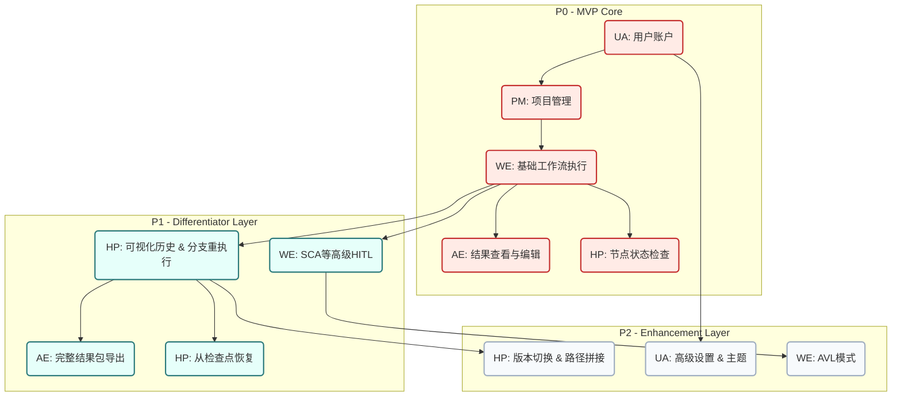
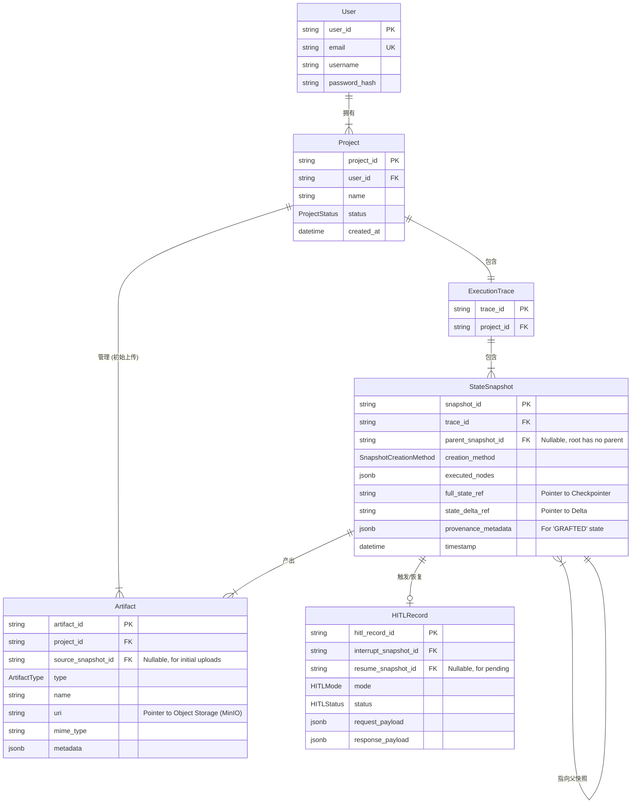

<design_doc>

<design_doc>

## 阶段 1：需求解析与体验愿景 - 核心用户画像

### 1. 摘要

本文档基于平台的核心工作流、高级溯源能力与用户需求，定义了本平台的目标用户原型——**“迭代式探索者” (The Iterative Explorer)**。此用户画像深度聚焦于在高认知负荷的数学建模与研究场景下，用户的核心动机、行为模式与关键痛点，旨在指导后续的产品设计与功能开发，确保平台能精准服务于其核心价值主张：**将混乱的探索过程转化为有序的知识资产**。

---

### 2. 核心用户画像：迭代式探索者 (The Iterative Explorer)

#### 2.1 人物原型

*   **姓名/原型**: Alex
*   **角色**: 顶尖高校的理工科研究生 / 积极参与高水平建模竞赛（如MCM/ICM）的本科生团队核心成员 / 从事量化分析或运筹优化方向的初级研究员。
*   **核心特质**: 具备强烈的学术好奇心和严谨的逻辑思维，追求的不是单一的“正确答案”，而是对问题所有可能性进行深入、可比较的探索。他们是“思考者”和“实验者”，而非简单的“执行者”。

#### 2.2 技术熟练度

*   **领域知识**: 精通其专业领域的理论知识，能快速理解赛题背后的数学和物理机制。
*   **建模能力**: 熟练掌握多种建模方法论（优化、仿真、预测等），但可能在将理论模型转化为完美代码时遇到困难或感到繁琐。
*   **工具使用**: 习惯使用 Jupyter Notebook, MATLAB, Python (Pandas, SciPy) 等工具进行探索性分析。对版本控制工具（如 Git）有基本概念，但在复杂的、非线性的建模项目中常常感到力不从心。
*   **AI 认知**: 将 LLM 视为一个强大的“副驾驶”或“研究助理”，期望它能处理结构化、重复性的工作（如代码生成、文本润色、初步分析），从而解放自己的精力以专注于更高层次的战略思考和创造性洞察。

#### 2.3 核心动机与目标 (Motivations & Goals)

1.  **实现分析的深度与严谨性**: 最终目标是产出一份无可指摘的、达到“O奖”级别或可发表水准的报告/论文。这要求模型不仅有效，而且其假设、边界和敏感性都经过了充分的论证和压力测试。
2.  **最大化探索效率**: 在有限的时间（如竞赛周末、项目周期）内，尽可能多地探索不同的建模路径、假设和参数组合。他们渴望能够“无成本”地进行“What-if”分析。
3.  **维持一条清晰的逻辑链**: 确保从最初的假设到最终的结论，整个分析过程逻辑连贯、可追溯、可复现。他们需要一个比传统实验记录本更强大的“思想轨迹记录仪”。
4.  **从认知过载中解放**: 将大脑从繁重的“状态管理”（例如，“哪个版本的代码生成了这张图？”、“如果修改假设A，需要重新运行哪些步骤？”）中解放出来，专注于问题的核心。

#### 2.4 关键痛点与挫败时刻 (Pains & Frustrations)

1.  **早期决策的“蝴蝶效应”**: 在项目初期做出的一个假设或模型选择，在后期被证明是次优的。回溯修改意味着巨大的、连锁性的重算成本，甚至可能需要推倒重来，这在时间压力下是毁灭性的。
2.  **“精神分裂式”的版本控制**: 当同时探索2-3条不同的思路时，Alex 必须在头脑中或通过混乱的文件命名（如 `model_v2_final.ipynb`, `model_v3_test_new_param.ipynb`）来管理人脑“分叉”，认知负荷极高，且极易出错。
3.  **逻辑链的断裂**: 在漫长的迭代后，很容易忘记最终图表所依赖的具体是哪个版本的中间数据和参数。当撰写论文需要解释一个异常结果时，无法快速、精确地回溯其成因，导致论证缺乏说服力。
4.  **人机协作的摩擦**: 在与 LLM 协作时，反复的复制粘贴、修改 Prompt、以及对生成内容的整合过程效率低下。他们期望一种更无缝、更结构化的交互方式，而不是在一个巨大的聊天窗口里“考古”。

---

### 3. 典型使用场景与行为模式

#### 场景：一个复杂的优化问题（如物流网络设计）

**阶段一：战略构思与假设建立**
*   **行为**: Alex 上传赛题描述和数据集。他首先关注平台在【阶段一】生成的**“正式问题重述与全局假设框架”**。他不会全盘接受，而是会启动 **VARL (审查式批准/拒绝循环)**，对其中几条关键假设提出修改意见，与 AI 共同打磨，直到这份“建模蓝图”与他的战略构思完全一致。
*   **期望**: 平台能将他模糊的想法结构化，并提供一个坚实的出发点。他把平台当作一个能进行逻辑辩论的伙伴。

**阶段二：模型探索与“What-if”时刻**
*   **行为**:
    1.  对于子任务“路径优化模型”，平台在【步骤 2.1】利用 **SCA (战略选择架构)** 提供了三种候选模型：A) 混合整数规划, B) 遗传算法, C) 模拟退火，并附带了优缺点分析。Alex 结合数据规模和求解时间，选择了 A。
    2.  模型运行至【步骤 2.2】并生成了初步结果。Alex 审查结果时发现，虽然最优，但计算时间过长，可能无法在规定时间内完成所有灵敏度分析。
    3.  **（关键时刻）** 他产生了一个疑问：“如果当初选择计算更快的 B) 遗传算法，结果会差多少？但对后续的库存策略又有什么影响？”
*   **期望与平台交互**:
    1.  **可视化回溯**: Alex 打开**可视化导航工具**，工作流的执行历史像一个 Git 分支图一样清晰地展现在眼前。
    2.  **无痛分叉**: 他定位到【步骤 2.1】的决策节点，右键点击并选择**“从此节点创建新版本”**。
    3.  **选择性重执行**: 在新的“分支”上，他选择了 B) 遗传算法。平台**仅重新执行**了【步骤 2.1】和【步骤 2.2】。
    4.  **结果拼接与比较**: 现在，他的工作流历史中有两个版本的【步骤 2.2】输出。他希望**复用**第一个分支中已经完成的【步骤 2.3】（库存策略分析）的结果，来快速评估新路径的影响。他使用平台的**“状态拼接”**功能，创建了一条混合路径：`... -> 步骤2.1(版本B) -> 步骤2.2(版本B) -> 步骤2.3(原始版本A)`。
    5.  **洞察与决策**: 通过快速比较两条路径的最终结果，他获得了宝贵的洞察，并决定在论文中将此作为“模型鲁棒性”的一部分进行讨论。这个过程只花了几分钟，而非数小时。

**阶段三：全局综合与论文锻造**
*   **行为**: Alex 汇集了所有探索路径中的最佳成果。他使用平台的富文本编辑器，在撰写论文时，可以轻松引用和插入来自**任何历史版本**的图表或数据，并且平台会自动记录其来源，确保了最终报告的严谨性和可追溯性。
*   **期望**: 平台是一个强大的叙事构建工具，能帮助他将所有零散的实验和发现，组织成一个逻辑严密、引人入胜的学术故事，并一键导出所有材料。

### 4. 总结：对平台的终极期望

“迭代式探索者” Alex 视本平台为一个**“带版本控制的智能实验室”**。他期望平台：

*   **在认知上**，作为他的第二大脑，卸下所有关于流程、版本和依赖管理的记忆负担。
*   **在工作流上**，提供一个非线性的、可自由探索的沙盒，让每一次“突发奇想”都能被低成本地验证。
*   **在产出上**，成为一个从混乱探索到清晰叙事的转换器，确保他的每一个洞察都有坚实的数据和逻辑支撑，最终成就卓越的分析成果。

</design_doc>

---

<design_doc>

## 1.2 功能需求与优先级矩阵 (Functional Requirements and Priority Matrix)

### 1. 概述与核心价值

本文档旨在全面整合项目的所有设计输入，包括工作流架构、人机协同（HITL）模式、高级溯源能力、基础用户需求以及用户画像（“迭代式探索者” Alex），从而提炼出一份结构化的、面向产品的完整功能需求清单。

清单的核心目标是指导产品开发，确保最终交付的平台能够实现其核心价值主张：**将研究人员（特别是数学建模者）混乱、非线性的探索过程，转化为有序、可追溯、可复用的知识资产，从而极大地提升分析深度与探索效率。**

所有功能均围绕解决“迭代式探索者”的关键痛点进行设计：消除早期决策的“蝴蝶效应”成本、管理“精神分裂式”的多路径探索、确保端到端的逻辑链完整性，以及降低人机协作的摩擦。

---

### 2. 功能模块划分

为了系统性地组织功能需求，我们将平台划分为以下五个核心功能模块：

1.  **用户账户与系统设置 (UA - User & Settings)**: 负责用户身份认证、个性化配置和系统级参数管理。
2.  **项目管理 (PM - Project Management)**: 负责用户工作空间、项目创建、数据管理和生命周期维护。
3.  **工作流执行与人机协同 (WE - Workflow & Execution)**: 平台的核心引擎，负责驱动建模流程、管理 AI 协作和处理用户在环（HITL）的决策点。
4.  **历史溯源与探索 (HP - History & Provenance)**: 平台的关键差异化模块，提供对工作流历史的非线性导航、编辑和重组能力。
5.  **结果产出与导出 (AE - Artifacts & Export)**: 负责所有中间及最终产物的编辑、整合与打包交付。

---

### 3. 详细功能需求与优先级矩阵

#### 3.1 优先级定义说明

*   **P0 (Must-have / 必须具备)**: 构成产品核心价值闭环的基石功能。缺失 P0 功能将导致平台无法完成最基本的用户旅程（从创建项目到获得初步结果）。
*   **P1 (Should-have / 应当具备)**: 直接解决核心用户痛点、体现平台差异化价值的高优先级功能。这些功能是实现“迭代式探索”体验的关键，对用户留存和满意度至关重要。
*   **P2 (Could-have / 可以具备)**: 增强用户体验、提升效率或提供高级灵活性的功能。这些功能非常有价值，但可以在核心价值得到验证后分阶段实施。
*   **P3 (Won't-have (for now) / 暂不具备)**: 已被识别但当前版本不予实现的功能，通常因为技术复杂度过高、依赖外部条件或优先级较低。

#### 3.2 功能需求详单

| 功能ID | 功能名称 | 功能描述 | 优先级 | 依赖关系 |
| :--- | :--- | :--- | :--- | :--- |
| **模块 1: 用户账户与系统设置 (UA)** |
| UA-1 | 邮箱与密码注册 | 用户可以通过提供电子邮箱和设置密码来创建新账户。系统需验证邮箱的唯一性。 | P0 | |
| UA-2 | 邮箱与密码登录 | 已注册用户可以使用其邮箱和密码登录平台。 | P0 | UA-1 |
| UA-3 | 用户设置面板 | 用户可以访问一个设置中心，包含账户信息、界面偏好和工作流引擎的配置区域。 | P1 | UA-2 |
| UA-4 | 账户信息管理 | 在设置面板中，用户可以查看其用户名和注册邮箱，并能修改登录密码。 | P1 | UA-3 |
| UA-5 | 界面主题切换 | 在设置面板中，用户可以在浅色（Light）和深色（Dark）主题之间切换。 | P2 | UA-3 |
| UA-6 | 工作流引擎配置 | 在设置面板中，用户可以为工作流引擎配置必要的参数，包括 LLM Provider 的模型名称、API 密钥和基础 URL。界面应提供输入框，后端实现可暂缓。 | P1 | UA-3 |
| **模块 2: 项目管理 (PM)** |
| PM-1 | 创建新项目 | 用户可以创建一个新的建模项目。创建时，系统引导用户在两种模式中选择其一：a) 自定义项目；b) 模板项目。 | P0 | UA-2 |
| PM-2 | 自定义项目创建流程 | 当选择自定义项目时，用户需要：1) 为项目命名；2) 上传赛题描述文件(如.txt, .md, .pdf)；3) 上传一个或多个数据集文件(如.csv, .xlsx)；4) 选择赛题类型(A-F)，或选择默认。 | P0 | PM-1 |
| PM-3 | 模板项目创建流程 | 当选择模板项目时，用户可以从平台提供的历年赛题库中选择一个预设项目（包含赛题、数据和类型），并以此为基础创建新项目。 | P1 | PM-1 |
| PM-4 | 项目列表/仪表盘 | 登录后，用户可以看到一个包含其所有项目的列表或卡片视图。每个项目应显示名称、创建日期等基本信息。 | P0 | UA-2 |
| PM-5 | 删除项目 | 用户可以从项目列表或项目内部删除一个不再需要的项目，系统需进行二次确认。 | P0 | PM-4 |
| PM-6 | 进入项目工作区 | 用户可以从项目列表点击进入特定项目的详细工作界面。 | P0 | PM-4 |
| **模块 3: 工作流执行与人机协同 (WE)** |
| WE-1 | 工作流阶段可视化 | 在项目工作区内，用户能清晰地看到当前工作流所处的宏观阶段（阶段一、二、三）和具体步骤。 | P0 | PM-6 |
| WE-2 | 自动化工作流推进 | 用户启动项目后，工作流引擎自动按预设逻辑（阶段一 -> 阶段二 -> 阶段三）执行，直至遇到需要人工干预的节点或执行完毕。 | P0 | WE-1 |
| WE-3 | 实时结果展示 | 随着工作流的执行，每一步生成的文本、图表或数据等中间结果会实时地展示在界面相应的区域。 | P0 | WE-2 |
| WE-4 | HITL：中断与交互 | 当工作流遇到预设的决策点时，执行会自动暂停，并向用户呈现一个清晰的人机交互界面。 | P0 | WE-2 |
| WE-5 | HITL：审查式批准/拒绝 (VARL) | 系统能够呈现待审内容（如假设列表），并提供“批准”和“拒绝”选项。若用户“拒绝”，系统需提供一个文本框让其输入修改意见，并将意见传回工作流以进行修订。 | P0 | WE-4 |
| WE-6 | HITL：战略选择架构 (SCA) | 系统能够呈现多个带有优缺点分析的候选方案（如不同模型），并允许用户选择其中一个方案以继续执行工作流。 | P1 | WE-4 |
| WE-7 | HITL：对抗性验证 (AVL) | 系统能够呈现一份对关键产出（如结论）的批判性评审报告，用户可以逐条“采纳”或“驳回”这些批判意见，并将裁决结果传回工作流以进行最终修正。 | P2 | WE-4 |
| **模块 4: 历史溯源与探索 (HP)** |
| HP-1 | 可视化历史导航图 | 系统提供一个可视化的、类似 Git 分支图的界面，展示项目工作流的完整执行历史，包括所有重新执行产生的“分支”和不同版本的节点。 | P1 | WE-2 |
| HP-2 | 节点状态检查 | 用户可以点击历史导航图上的任意一个已执行节点，查看该节点在当时执行完成后的所有状态和产出（包括文本、数据、图表等）。 | P0 | HP-1 |
| HP-3 | 从历史节点创建新分支 (选择性重执行) | 用户可以在历史导航图上右键点击任一节点，选择“从此节点重新执行”。系统将以此节点之前的状态为基础，创建一个新的执行分支，并开始重新计算后续步骤。 | P1 | HP-1 |
| HP-4 | 节点版本切换 | 对于存在多个历史版本（来自不同分支）的节点，用户可以在导航图中清晰地看到这些版本。用户应能选择将某个特定分支的“活动版本”切换为历史上的另一个版本。 | P2 | HP-3 |
| HP-5 | 动态路径拼接 (State Splicing) | 用户能够创建一个新的“混合”执行路径，通过从不同历史分支中“挑选”并“拼接”各个步骤的结果。例如，使用分支A的步骤1结果，拼接分支B的步骤2结果，然后继续执行步骤3。 | P2 | HP-3, HP-4 |
| HP-6 | 从任意检查点恢复执行 | 在通过重执行或拼接构建了一条新的（可能不完整的）路径后，用户可以从该路径的末端无缝地继续执行工作流中剩余的未执行节点。 | P1 | HP-3, HP-5 |
| **模块 5: 结果产出与导出 (AE)** |
| AE-1 | 中间文本结果的在线编辑 | 对于工作流生成的任何文本内容（如问题重述、模型分析、论文草稿），用户都可以通过一个富文本编辑器（所见即所得）进行修改，并保存更改。 | P0 | WE-3 |
| AE-2 | 保存编辑后的结果 | 用户在编辑器中所做的修改可以被保存，并作为当前版本的正式输出，供后续工作流步骤使用或最终导出。 | P0 | AE-1 |
| AE-3 | 一键导出完整结果包 | 在项目的任何时刻，用户都可以点击“导出”按钮，下载一个包含当前活动分支所有产出的 .zip 压缩包。 | P1 | WE-3, HP-1 |
| AE-4 | 导出包内容规范 | 导出的压缩包必须结构清晰，包含：1) O奖格式的完整论文(.docx/.pdf)，2) 所有相关的源代码文件，3) 论文中引用的所有图表和附件，4) 一份包含所有关键中间结果的快照。 | P1 | AE-3 |

---

### 4. 功能依赖关系图

下图展示了核心功能模块之间的主要依赖关系，揭示了推荐的开发路径。基础的用户和项目管理是所有功能的前提。工作流执行是核心，而历史溯源功能则建立在工作流可被记录和执行的基础上，最终所有结果汇集到导出模块。



</design_doc>

---

<design_doc>

## 1.3 体验愿景与美学原则 (Experience Vision and Aesthetic Principles)

### 1. 摘要

本文档旨在确立指导平台所有设计决策的核心体验愿景、交互哲学与前沿美学标准。我们的愿景是，将平台从一个线性的、工具化的软件，升华为一个**动态的、可供探索的“时空知识工作站” (Chronospatial Knowledge Workstation)**。它不仅是执行任务的工具，更是用户（“迭代式探索者”）思想轨迹的活态可视化，是一个能将混乱探索过程转化为有序知识资产的智能环境。

本设计原则深度回应了“迭代式探索者”的核心痛点——高认知负荷、版本管理混乱、逻辑链易断裂。我们将通过四大核心体验支柱、前沿的“动态信息几何学”美学、功能性的动效哲学以及对极致流畅性的追求，来打造一个既能支持高强度复杂认知任务，又能提供极致流畅、动态且富有未来感的交互体验，最终实现对用户创造力与洞察力的最大化赋能。

---

### 2. 核心体验支柱 (Core Experience Pillars)

以下四大支柱构成了我们产品体验的基石，指导所有功能和交互的设计。

#### 2.1 无负担的心智卸载 (Effortless Cognitive Offloading)

*   **愿景**: 平台应成为用户的“第二大脑”，主动承担所有关于流程、版本、依赖和状态管理的记忆负担。用户应从“我需要记住如果修改了A，就要重跑B和C”的思维模式，转变为“我想看看修改A会发生什么”的纯粹探索模式。
*   **设计原则**:
    *   **自动化的溯源**: 系统必须自动捕捉每一次执行、每一个决策、每一个版本，无需用户手动记录。
    *   **可视化的依赖**: 节点间的关系、数据的流转必须直观可见，让用户一眼就能理解其因果链。
    *   **情境化的行动**: 系统应在用户需要时，主动提供相关操作（如“创建分支”、“对比版本”），而不是让用户在复杂的菜单中寻找。

#### 2.2 时空探索的具象化 (Tangible Chronospatial Exploration)

*   **愿景**: 工作流的执行历史不应是一份扁平的日志，而应是一个可被直接操纵的多维空间。用户应该能像在地图上导航一样，在项目的“时间线”和“可能性分支”之间自由穿梭。
*   **设计原则**:
    *   **历史即地图**: 将历史溯源（HP-1）的可视化导航图作为应用的核心交互界面，而非一个附属功能。
    *   **直接操纵**: 将抽象的后端能力（如选择性重执行、状态拼接）转化为具象的、可直接操纵的UI行为。例如，通过拖拽连接不同分支的节点来完成“拼接”，或右键点击节点创建“新分支”。
    *   **版本的主体性**: 每个节点的历史版本都应被视为一等公民，易于访问、比较和切换。

#### 2.3 无缝的智能协同 (Seamless Intelligence Symbiosis)

*   **愿景**: 人与AI的协作不应是“命令-执行”的模式，而应是流畅、情境感知、双向启发的共生关系。AI的产出与用户的决策应在同一个界面中无缝融合。
*   **设计原则**:
    *   **嵌入式交互**: HITL交互（如VARL、SCA）不应是突兀的弹窗，而应是工作流中一个自然的、设计精美的环节，与上下文融为一体。
    *   **可解释与可干预**: AI生成的任何内容（如候选模型、批判性评审）都必须提供清晰的论证，并为用户提供明确的干预和编辑入口。
    *   **渐进式增强**: AI应能学习用户的偏好（即使是隐性的），在后续的交互中提供更个性化、更精准的建议。

#### 2.4 从混沌到叙事的转换 (From Chaos to Narrative)

*   **愿景**: 平台不仅要支持探索过程的“发散”，更要赋能最终成果的“收敛”。它应成为一个强大的叙事构建工具，帮助用户将所有零散的实验和发现，组织成一个逻辑严密、引人入胜的学术故事。
*   **设计原则**:
    *   **来源的可追溯性**: 在最终的编辑器（AE-1）中，任何从工作流中引用的图表、数据或文本，都必须能一键追溯到其产生的具体历史版本和上下文。
    *   **灵活的内容编排**: 提供强大的富文本编辑能力，允许用户自由地整合、修改和注释来自不同探索分支的产出。
    *   **一键式的完整性**: 导出功能（AE-3）必须保证产出的完整性和专业性，将用户从繁琐的格式整理和文件收集中解放出来。

---

### 3. 前沿美学定位：动态信息几何学 (Pioneering Aesthetic: Dynamic Information Geometry)

我们的视觉风格旨在精确传达“时空知识工作站”的定位，它融合了科幻电影界面（Sci-Fi UI）的未来感、数据可视化的精确性以及现代建筑的结构美学。

*   **核心理念**: 将抽象的数据流、逻辑分支和时间演变，转化为优雅、清晰、可交互的几何形态。界面即是信息本身的可视化。
*   **灵感来源**: 
    *   **科幻界面 (FUI)**: 如电影《少数派报告》、《创：战纪》中充满未来感的透明、分层、动态的交互界面。
    *   **数据可视化艺术**: 将复杂数据集转化为美学作品的实践。
    *   **包豪斯设计**: 强调功能性、极简主义和几何形式。
*   **设计语言**:
    *   **清晰与精确 (Clarity & Precision)**: 基于`Shadcn/ui`和`Tailwind CSS`，建立一个由严格的网格系统、精准的间距和清晰的`Geist`字体构成的秩序感。界面首先必须是清晰易读的。
    *   **深度与层次 (Depth & Layering)**: 广泛使用`Glassmorphism`（毛玻璃效果）、背景模糊、半透明图层和辉光效果（Glow），在二维屏幕上创造出 Z 轴深度感。这有助于区分UI层次（如模态框、侧边栏）和信息层次。
    *   **光线与材质 (Light & Material)**: 使用`BorderBeam`、`ShineBorder`等`Magic UI`组件，通过模拟光线在界面元素边缘的流动，来引导用户注意力、指示活动状态或增添精致感。
    *   **专注的色彩**: 采用以深色模式为主的色彩方案。基础UI保持中性（黑、白、灰），功能性色彩（如蓝色、紫色）作为强调，用于可交互元素、高亮状态和数据流。状态色（绿、黄、红）清晰地传达成功、警告和错误。
    *   **统一的图标**: 优先使用 `Lucide React` 图标库，确保所有图标风格一致、表意清晰，作为几何美学语言的延伸。

---

### 4. 动效哲学：作为叙事与交互媒介的动态化 (Motion Philosophy: Motion as Narrative & Medium)

在本平台，动效（Motion）绝非装饰，而是实现体验愿景的核心功能。我们遵循**“动效即功能 (Motion is Function)”**的原则，利用 `Framer Motion` 将动效深度整合到每一次交互和状态变迁中。

*   **核心作用**:
    1.  **解释因果与状态**: 动效用于可视化状态之间的转换。当一个节点重新执行时，其内容不是瞬间替换，而是通过渐变、形变或粒子效果“再生”，向用户解释“这里发生了计算”。数据的流动应通过光束或粒子在连接线上的移动来表示。
    2.  **构建空间与方向**: 当用户在历史导航图中平移、缩放或跳转时，流畅的过渡动画是维持其空间感的关键。这能防止用户在复杂的历史图谱中“迷路”。
    3.  **引导注意与反馈**: 动效被用来温和地引导用户的注意力。当一个需要人工干预的HITL节点出现时，它可能会发出柔和的脉冲光效。用户的点击、拖拽等操作，必须伴随着即时、符合物理直觉的动画反馈，创造“可触碰”的交互感。
    4.  **提升感知性能**: 在等待后端计算时，富有创意的加载动画（如模拟数据流动的`FlickeringGrid`或数字跳动的`NumberTicker`）可以有效缓解用户的等待焦虑，提升应用的感知流畅度。

---

### 5. 流畅性与响应性：零延迟的心流保障 (Fluidity & Responsiveness: Zero-Latency Flow State)

*   **核心目标**: 保护用户的“心流” (Flow State) 不被任何技术延迟或卡顿所打断。每一次交互都应感觉是即时的、直接的和可靠的。
*   **技术与设计标准**:
    *   **即时反馈 (<100ms)**: 所有基础UI交互（点击、悬停、输入）的视觉反馈必须在100毫秒内完成。
    *   **乐观更新 (Optimistic UI)**: 对于需要与后端通信的操作（如保存编辑），前端应立即更新UI至最终状态，并在后台处理请求。如果失败，再优雅地回滚并提示用户。
    *   **非阻塞式后台任务**: 任何耗时超过500毫秒的后台操作（如工作流执行、数据加载）绝对不能阻塞UI线程。必须使用清晰的、非侵入式的加载指示器（如节点内的微型加载环、进度条）来传达后台活动。
    *   **可预测的性能**: 动画和过渡必须在各种设备上保持流畅（目标60fps）。对于复杂的`React Flow`图，需要进行性能优化，如节点虚拟化，确保即使在包含数百个节点的复杂历史图中也能流畅导航。

</design_doc>

---

<design_doc>

## 2.1 内容模型与分类法 (Content Model and Taxonomy)

### 1. 摘要

本文档定义了平台的核心内容模型与分类体系，旨在为“时空知识工作站”的愿景提供坚实的结构化数据基础。基于对“迭代式探索者”用户画像的深刻理解，以及对“高级工作流溯源与动态路径组合”这一核心技术需求的支撑，本模型将工作流的执行历史从一个线性的日志，抽象为一个由**状态快照 (State Snapshot)** 构成的、可分支、可拼接的有向无环图 (DAG)。

此内容模型是实现平台核心体验——无负担的心智卸载、时空探索的具象化——的底层基石。通过精确定义项目、执行轨迹、状态快照、产物和人机交互记录等核心对象及其关系，我们为前端实现可视化的历史导航图 (HP-1)、节点状态检查 (HP-2)、创建新分支 (HP-3) 以及动态路径拼接 (HP-5) 提供了完整、一致且可查询的数据结构。

---

### 2. 核心概念与关系图

平台的数据核心是围绕着 `Project` 展开的一个多层次的、带版本控制的知识图谱。其关系可以概括如下：

*   一个 `User` 可以拥有多个 `Project`。
*   一个 `Project` 包含一个唯一的 `ExecutionTrace`，后者是该项目所有执行历史的容器。
*   一个 `ExecutionTrace` 由多个 `StateSnapshot` 组成，它们通过父子关系链接，形成一个图状结构。
*   每个 `StateSnapshot` 代表工作流在某一时刻的完整状态，并记录了它是如何被创建的（例如，通过执行或拼接）。
*   在执行过程中产生的任何持久化产物（如数据集、图表），都作为一个 `Artifact` 进行管理，并与创建它的 `StateSnapshot` 相关联。
*   当工作流暂停以进行人机交互时，会创建一个 `HITLRecord`，它与触发中断和恢复执行的 `StateSnapshot` 相关联。



---

### 3. 核心内容对象定义

#### 3.1 `Project` (项目)

*   **描述**: 用户工作的主要容器，代表一次完整的建模任务。它封装了与该任务相关的所有数据、配置和执行历史。
*   **属性**:
    | 属性名 | 类型 | 描述 |
    | :--- | :--- | :--- |
    | `project_id` | UUID | 主键，项目的唯一标识符。 |
    | `user_id` | UUID | 外键，指向所属的 `User`。 |
    | `name` | String | 用户为项目指定的名称。 |
    | `status` | Enum (`ProjectStatus`) | 项目的当前生命周期状态（如：`IDLE`, `RUNNING`, `PAUSED`, `COMPLETED`, `ERROR`）。 |
    | `config` | JSON | 项目的初始配置，如赛题类型、选择的模板等。 |
    | `created_at` | DateTime | 项目的创建时间。 |
    | `updated_at` | DateTime | 项目的最后更新时间。 |
*   **关系**:
    *   属于一个 (1) `User`。
    *   包含一个 (1) `ExecutionTrace`。
    *   包含多个 (M) `Artifact` (特指用户初始上传的数据集和赛题文件)。

#### 3.2 `ExecutionTrace` (执行轨迹)

*   **描述**: 一个逻辑容器，用于汇集单一项目下**所有**的执行历史快照。它本身不包含状态数据，而是作为所有 `StateSnapshot` 的根，构成了完整的、可分支的执行图谱。
*   **属性**:
    | 属性名 | 类型 | 描述 |
    | :--- | :--- | :--- |
    | `trace_id` | UUID | 主键，执行轨迹的唯一标识符。 |
    | `project_id` | UUID | 外键，指向所属的 `Project`。 |
*   **关系**:
    *   属于一个 (1) `Project`。
    *   包含多个 (M) `StateSnapshot`。

#### 3.3 `StateSnapshot` (状态快照)

*   **描述**: **内容模型的核心**。它代表工作流在某个特定时间点（一个“超步”执行后）的不可变状态。所有快照通过 `parent_snapshot_id` 链接，形成一个有向无环图（DAG），完美地支持了分支、合并和版本化的需求。
*   **属性**:
    | 属性名 | 类型 | 描述 |
    | :--- | :--- | :--- |
    | `snapshot_id` | UUID | 主键，快照的唯一标识符。 |
    | `trace_id` | UUID | 外键，指向所属的 `ExecutionTrace`。 |
    | `parent_snapshot_id` | UUID | **核心关系字段**。指向其前驱快照。根快照此字段为空。支持多父节点以实现合并（暂定为单父，简化模型）。 |
    | `creation_method` | Enum (`SnapshotCreationMethod`) | **核心溯源字段**。记录此快照是如何产生的（`EXECUTED`, `GRAFTED`, `INITIAL`）。对UI可视化至关重要。 |
    | `executed_nodes` | JSON Array | 记录在生成此快照的“超步”中，实际被执行的节点名称列表。 |
    | `full_state_ref` | String | 指向持久化层（如Checkpointer）中该快照的完整状态数据的引用/指针。 |
    | `state_delta_ref` | String | 指向持久化层中该快照的状态增量（Delta）数据的引用/指针。用于高效的 `Delta Injection`。 |
    | `provenance_metadata` | JSON | 用于存储溯源元数据。例如，当 `creation_method` 为 `GRAFTED` 时，此处存储 `{ "source_snapshot_id": "..." }`。 |
    | `timestamp` | DateTime | 快照的创建时间戳。 |
*   **关系**:
    *   属于一个 (1) `ExecutionTrace`。
    *   指向一个 (1) 父 `StateSnapshot` (形成链/图)。
    *   可以产出多个 (M) `Artifact`。
    *   可以关联一个 (1) `HITLRecord`。

#### 3.4 `Artifact` (产物)

*   **描述**: 在工作流生命周期中上传或生成的任何持久化数字对象。通过将其与 `StateSnapshot` 关联，我们确保了每一个图表、代码文件或中间数据都具有完整的可追溯性。
*   **属性**:
    | 属性名 | 类型 | 描述 |
    | :--- | :--- | :--- |
    | `artifact_id` | UUID | 主键，产物的唯一标识符。 |
    | `project_id` | UUID | 外键，指向所属的 `Project`，便于项目级管理。 |
    | `source_snapshot_id` | UUID | 外键，指向创建此产物的 `StateSnapshot`。对于用户初始上传的文件，此字段可为空。 |
    | `type` | Enum (`ArtifactType`) | 产物的分类（如：`DATASET`, `REPORT_DRAFT`, `FIGURE`, `SOURCE_CODE`）。 |
    | `name` | String | 文件名或产物的可读名称。 |
    | `uri` | String | **核心引用字段**。指向对象存储（如MinIO）中的实际文件位置。状态中只存储引用，不存储实体。 |
    | `mime_type` | String | 文件的 MIME 类型，用于前端正确呈现。 |
    | `metadata` | JSON | 存储与产物相关的其他元数据，如图像尺寸、表格的行数/列数等。 |
*   **关系**:
    *   属于一个 (1) `Project`。
    *   由一个 (1) `StateSnapshot` 产出。

#### 3.5 `HITLRecord` (人机交互记录)

*   **描述**: 记录了一次完整的人机在环（HITL）交互过程，从工作流中断到用户提供反馈并恢复执行。
*   **属性**:
    | 属性名 | 类型 | 描述 |
    | :--- | :--- | :--- |
    | `hitl_record_id` | UUID | 主键，交互记录的唯一标识符。 |
    | `interrupt_snapshot_id` | UUID | 外键，指向触发此次中断的 `StateSnapshot`。 |
    | `resume_snapshot_id` | UUID | 外键，指向用户提交反馈后，工作流恢复执行时创建的 `StateSnapshot`。在交互完成前为空。 |
    | `mode` | Enum (`HITLMode`) | 本次交互的模式（`VARL`, `SCA`, `AVL`）。 |
    | `status` | Enum (`HITLStatus`) | 交互的当前状态（`PENDING_REVIEW`, `COMPLETED`）。 |
    | `request_payload` | JSON | 发送给前端用于渲染交互界面的完整数据（如待审内容、候选方案列表）。 |
    | `response_payload`| JSON | 用户提交的反馈数据（如批准/拒绝、选择的方案、裁决结果）。 |
    | `created_at` | DateTime | 交互开始的时间。 |
    | `completed_at` | DateTime | 交互完成的时间。 |
*   **关系**:
    *   与两个 `StateSnapshot` 关联，分别代表交互的开始和结束。

---

### 4. 分类法与受控词汇表 (Taxonomy and Controlled Vocabularies)

以下枚举类型（Enums）构成了平台的分类体系，用于确保数据的一致性、可查询性和在UI上的正确表达。

*   **`ProjectStatus`**:
    *   `IDLE`: 项目已创建，但未运行。
    *   `RUNNING`: 工作流正在自动执行。
    *   `PAUSED`: 工作流因HITL而暂停，等待用户输入。
    *   `COMPLETED`: 工作流所有阶段已成功执行完毕。
    *   `ERROR`: 工作流执行中遇到不可恢复的错误。

*   **`SnapshotCreationMethod`** (支持溯源能力的核心分类):
    *   `INITIAL`: 项目的初始状态，通常在项目创建后生成。
    *   `EXECUTED`: 通过正常执行工作流中的一个或多个节点而创建。这是最常见的类型。
    *   `GRAFTED`: 通过“状态拼接”操作，从另一个历史快照中“嫁接”而来，并未实际执行计算。
    *   `RESUMED`: 在用户完成一次HITL交互后，工作流恢复执行时创建的快照。

*   **`ArtifactType`**:
    *   `PROBLEM_STATEMENT`: 赛题描述文件。
    *   `DATASET`: 数据集文件。
    *   `REPORT_DRAFT`: 自动生成的或用户编辑的论文草稿。
    *   `FIGURE`: 模型生成的图表（如PNG, SVG）。
    *   `TABLE_DATA`: 模型生成的表格数据（如CSV, JSON）。
    *   `SOURCE_CODE`: 模型执行的源代码文件（如Python脚本）。
    *   `INTERMEDIATE_RESULT`: 其他可序列化的中间结果。

*   **`HITLMode`**: (与工作流定义一致)
    *   `VARL`: 审查式批准/拒绝循环。
    *   `SCA`: 战略选择架构。
    *   `AVL`: 对抗性验证循环。
    *   `BYPASS`: 无需人工交互，直接通过。

*   **`HITLStatus`**:
    *   `PENDING_REVIEW`: 等待用户处理。
    *   `COMPLETED`: 用户已提交反馈。

</design_doc>

---

<design_doc>

### 2.2 信息架构图（文本描述）(Information Architecture Diagram - Textual Description)

#### 1. 摘要

本文档通过详尽的文本描述，构建了产品的全局信息架构（IA），旨在替代传统的视觉站点地图。本架构的核心目标是为“时空知识工作站”这一体验愿景提供坚实的结构支撑。设计的关键挑战在于，如何优雅地整合并清晰地导航两种截然不同的用户心智模型：一是面向初次执行的、线性的、引导式的**“执行模式”**；二是为了深度探索的、非线性的、地图式的**“历史模式”**。

本信息架构遵循**情境驱动**和**层级扁平化**的原则，通过一个创新的双模式导航面板，确保用户无论是在遵循预设流程，还是在自由探索时空分支，都能拥有清晰的路径感和极低的认知负荷，从而无缝地在“执行者”与“探索者”两种角色间切换。

---

#### 2. 核心信息架构原则

1.  **双模式分离 (Dual-Mode Separation)**: 产品的核心交互区域（项目工作区）被明确划分为“执行视图”和“历史视图”两种模式。这两种模式共享主内容区，但提供截然不同的导航和交互逻辑，以分别匹配线性和非线性探索的用户心智。
2.  **情境驱动的界面 (Context-Driven Interface)**: 界面上展示的控件和信息，会根据用户当前所处的模式和上下文（例如，是查看实时结果还是审查历史快照）动态调整，避免信息过载。
3.  **全局锚点与局部焦点 (Global Anchors, Local Focus)**: 无论用户深入到多复杂的历史分支，一个持久化的全局导航栏始终提供返回主仪表盘和访问用户设置的稳定“锚点”。同时，工作区内的设计将引导用户聚焦于当前任务。
4.  **直接操纵与可见性 (Direct Manipulation & Visibility)**: 核心的溯源操作（如创建分支）被设计为对可视化元素的直接操作（如右键菜单），使用户能够直观地理解其行为的后果。系统的状态（如当前活动分支）必须始终清晰可见。

---

#### 3. 顶层结构与导航

产品的整体结构分为两大区域：**公共区域（用户未认证）** 和 **私有区域（用户已认证）**。

##### 3.1 公共区域 (Public Area - Unauthenticated)

*   **/login (登录页)**
    *   **内容**: 邮箱输入框、密码输入框、登录按钮 (UA-2)。
    *   **导航**: 包含指向注册页的链接。成功登录后，用户被重定向至 `/dashboard`。
*   **/register (注册页)**
    *   **内容**: 邮箱输入框、密码设置框、注册按钮 (UA-1)。
    *   **导航**: 包含指向登录页的链接。成功注册后，用户被重定向至 `/dashboard`。

##### 3.2 私有区域 (Private Area - Authenticated)

用户登录后，应用呈现为一个包含持久化**全局导航栏**的应用外壳。

*   **全局导航栏 (Global Navigation Bar)**:
    *   **位置**: 通常位于屏幕顶部，始终可见。
    *   **组件**:
        *   **Logo / Home Icon**: 点击后导航至项目仪表盘 (`/dashboard`)。
        *   **用户头像/菜单**: 位于右侧，点击后展开下拉菜单，包含：
            *   **设置 (Settings)**: 导航至用户设置页 (`/settings`)。
            *   **退出登录 (Logout)**: 结束会话，返回登录页 (`/login`)。

---

#### 4. 核心功能区域详述

##### 4.1. 项目仪表盘 (Projects Dashboard)

*   **路由**: `/dashboard`
*   **角色**: 用户登录后的主入口，所有工作的起点。
*   **布局与内容**:
    *   **主区域**: 以卡片或列表形式展示用户的所有项目 (PM-4)。每个项目卡片显示项目名称、状态、更新时间，并作为进入该项目工作区的入口。
    *   **主要操作**: 页面上有一个显眼的“创建新项目”按钮 (PM-1)。
*   **导航路径**:
    *   点击“创建新项目”按钮，打开一个全屏模态框或导航至 `/project/new`，启动项目创建流程。
    *   点击任一项目卡片，导航至该项目的专属工作区，路由为 `/project/{projectId}` (PM-6)。
    *   点击项目卡片上的“删除”图标，触发二次确认后删除项目 (PM-5)。

##### 4.2. 项目创建流程 (Project Creation)

*   **路由**: 通常以模态框形式呈现在 `/dashboard` 上，或一个独立的页面 `/project/new`。
*   **角色**: 引导用户完成一个新项目的初始化设置。
*   **布局与内容**:
    *   一个多步骤的向导式表单。
    *   **步骤 1**: 选择项目模式：“自定义项目”或“从模板创建” (PM-1)。
    *   **步骤 2 (自定义)**: 提供项目名称输入框、赛题文件上传控件、数据集文件上传控件（支持多文件）、赛题类型选择器 (PM-2)。
    *   **步骤 2 (模板)**: 展示一个可搜索/筛选的历年赛题模板列表供用户选择 (PM-3)。
*   **导航路径**:
    *   成功创建项目后，系统自动将用户导航至新项目的详情页 `/project/{newProjectId}`，并自动开始执行工作流。

##### 4.3. 用户设置 (User Settings)

*   **路由**: `/settings`
*   **角色**: 集中管理用户个人信息和应用级配置。
*   **布局与内容**:
    *   采用标签页式布局，清晰地划分不同设置类别 (UA-3)。
    *   **账户 (Account) 标签页**: 显示用户名、邮箱，并提供修改密码的功能 (UA-4)。
    *   **界面 (Interface) 标签页**: 提供浅色/深色主题的切换开关 (UA-5)。
    *   **工作流引擎 (Engine) 标签页**: 包含用于配置 LLM Provider (模型、API Key、Base URL) 的表单输入框 (UA-6)。

##### 4.4. 项目工作区 (Project Workspace)

*   **路由**: `/project/{projectId}`
*   **角色**: **产品的核心**。这是一个集工作流执行、人机交互、历史探索与内容编辑于一体的集成开发环境（IDE）。
*   **核心布局**: 采用一个高度动态的三栏式（或两栏式）布局。
    1.  **左侧：导航面板 (Navigation Panel)**
    2.  **中间：主内容区 (Main Content Area)**
    3.  **顶部：工作区头部 (Workspace Header)**

*   **布局详述**:

    *   **[顶部] 工作区头部 (Workspace Header)**:
        *   **内容**: 显示当前项目名称、工作流状态指示器（如“运行中”、“已暂停”、“已完成”），以及全局性的“一键导出”按钮 (AE-3)。

    *   **[左侧] 导航面板 (Navigation Panel) - 双模式核心**:
        *   此面板的顶部有一个清晰的**模式切换器**（如 Tabs 或 Toggle Switch），允许用户在**“执行视图”**和**“历史视图”**之间切换。
        *   **模式一：执行视图 (Execution View)**
            *   **外观**: 一个简化的、垂直的步骤列表或树，展示工作流的线性结构（例如：阶段一 -> 步骤2.1 -> 步骤2.2 -> 阶段三）。
            *   **功能**:
                *   清晰地高亮当前正在执行或等待人工输入的步骤 (WE-1)。
                *   为用户提供一个清晰的、引导式的路径，让他们能按部就班地跟进工作流。
                *   点击某个步骤，会在**中间内容区**加载该步骤的实时结果。
        *   **模式二：历史视图 (History View)**
            *   **外观**: 切换后，此面板将展示一个使用 `React Flow` 渲染的、可交互的、类似 Git 分支图的节点图 (HP-1)。
            *   **功能**:
                *   可视化展示项目的完整、非线性的执行历史，包括所有分支和合并。
                *   用户可以自由平移、缩放来探索这个“时空地图”。
                *   点击图上的任一历史节点，会在**中间内容区**加载该节点**当时**的状态快照 (HP-2)。
                *   **右键点击**节点，会弹出一个上下文菜单，提供核心溯源操作，如“从此节点创建新分支” (HP-3) 或“切换至此版本” (HP-4)。

    *   **[中间] 主内容区 (Main Content Area)**:
        *   **角色**: 这是工作区的主要显示和交互区域，其内容完全由**左侧导航面板**的当前选择所驱动。
        *   **情境一：当在“执行视图”中选择一个活动步骤时**:
            *   此区域展示该步骤的**最新**产出：生成的文本、数据表格、可视化图表等 (WE-3)。
            *   如果工作流在此暂停，则会渲染相应的人机交互（HITL）组件，如 VARL 的批准/拒绝按钮 (WE-5) 或 SCA 的选项卡 (WE-6)。
            *   所有文本内容都通过富文本编辑器呈现，允许用户直接在线编辑和保存 (AE-1, AE-2)。
        *   **情境二：当在“历史视图”中选择一个历史节点时**:
            *   此区域展示该节点在**那个特定历史时刻**的**只读**快照。用户可以查看但不能直接修改。
            *   UI 会有明确的视觉提示（如“历史模式”、“只读”的标签），以防用户混淆。

*   **核心导航路径与信息流**:
    1.  **线性执行**: 用户进入项目，默认在**执行视图**。工作流自动推进，左侧面板的步骤高亮随之移动，中间内容区实时更新结果。遇到 HITL，中间区域呈现交互界面，用户决策后，工作流继续。
    2.  **进入探索**: 用户在任何时候，点击左侧面板的切换器进入**历史视图**。
    3.  **历史回溯**: 在历史图中，用户点击任意节点，中间内容区变为该节点的历史快照查看器。
    4.  **创建分支 (非线性操作)**: 用户在历史图的节点 `N` 上右键选择“创建新分支”。此时，系统会：
        *   在后端创建一个新的执行分支。
        *   **自动将左侧面板切换回“执行视图”**，但视图内容现在显示的是这个新分支的路径。
        *   UI 明确提示用户“当前处于分支 X”。
        *   工作流从节点 `N` 之后开始重新执行。
    5.  **恢复执行 (HP-6)**: 无论是创建新分支还是通过路径拼接 (HP-5) 创造了不完整的路径，用户都可以从新路径的末端继续执行剩余的工作流节点。

通过这种方式，信息架构在逻辑上将线性和非线性操作分离开来，但在 UI 上又提供了一个极其流畅的切换机制，完美支撑了“迭代式探索者”的核心需求。

</design_doc>

---

<design_doc>

### 2.3 核心任务流程（文本描述）(Core Task Flows - Textual Description)

#### 1. 摘要

本文档详细描述了用户（“迭代式探索者” Alex）在平台内完成关键任务的路径。这些文本化流程旨在替代传统的视觉流程图，为UI/UX设计和前后端开发提供清晰、详尽的指导。

流程设计严格遵循信息架构中定义的**“执行模式”**（线性、引导式）与**“历史模式”**（非线性、探索式）的双模式交互框架。每个任务流都旨在最小化用户的认知负荷，使其能够无缝地在“执行者”和“探索者”这两种角色之间切换，最终实现“时空知识工作站”的体验愿景。

---

#### 2. 任务流程详述

##### **任务 1: 用户注册、登录与创建新项目**

*   **核心目标**: 新用户 Alex 注册账户，并成功创建一个新的建模项目，使其进入可执行状态。
*   **前置条件**: 无。
*   **流程步骤**:
    1.  **入口**: Alex 访问平台主页，默认进入 `/login` 页面。
    2.  **注册**:
        *   **用户操作**: 点击“还没有账户？注册”链接，导航至 `/register`。
        *   **用户操作**: 在注册表单中输入邮箱和密码，点击“注册” (UA-1)。
        *   ***系统响应***: 后端验证邮箱唯一性。成功后，创建用户账户，并自动将 Alex 登录，重定向至项目仪表盘 `/dashboard`。如果邮箱已存在，则显示错误提示。
    3.  **登录 (后续访问)**:
        *   **用户操作**: 在 `/login` 页面输入邮箱和密码，点击“登录” (UA-2)。
        *   ***系统响应***: 验证凭据。成功后，重定向至项目仪表盘 `/dashboard`。
    4.  **创建项目**:
        *   **用户操作**: 在仪表盘页面，点击显眼的“创建新项目”按钮 (PM-1)。
        *   ***系统响应***: 弹出一个全屏模态框，展示项目创建向导。
    5.  **选择项目模式 (分支)**:
        *   **分支 A: 自定义项目 (PM-2)**
            1.  **用户操作**: 选择“自定义项目”。
            2.  **用户操作**: 在向导中输入项目名称。
            3.  **用户操作**: 点击文件上传区域，选择并上传一个赛题描述文件（如 .pdf, .md）和一个或多个数据集文件（如 .csv）。
            4.  **用户操作**: 从下拉菜单中选择赛题类型（A-F），或保留默认。
            5.  **用户操作**: 点击“创建并启动”按钮。
        *   **分支 B: 模板项目 (PM-3)**
            1.  **用户操作**: 选择“从模板创建”。
            2.  **用户操作**: 浏览或搜索平台提供的历年赛题模板列表，点击一个感兴趣的模板卡片。
            3.  **用户操作**: 点击“基于此模板创建项目”。
    6.  **项目初始化**:
        *   ***系统响应***: 后端创建一个新项目，关联上传的文件或模板数据，生成初始状态快照。
        *   ***系统响应***: 系统自动将 Alex 导航至新项目的专属工作区 `/project/{newProjectId}`。
        *   ***系统响应***: 工作流引擎自动开始执行【阶段一】的第一个步骤，工作区进入“执行视图” (WE-2)。
*   **结束状态**: Alex 成功登录并位于新创建的项目工作区内，工作流正在自动执行，他可以实时看到【阶段一】的产出。

##### **任务 2: 执行工作流并处理人机协同 (HITL) 中断**

*   **核心目标**: Alex 跟随工作流的自动执行，并在系统暂停时，根据不同的 HITL 模式做出决策，以推动流程继续或进行修订。
*   **前置条件**: 项目已创建，工作流正在运行中。
*   **流程步骤**:
    1.  **自动执行**:
        *   ***系统响应***: 工作流引擎按顺序执行节点。在左侧的“执行视图”导航面板中，当前执行的步骤被高亮。中间的主内容区实时更新该步骤生成的文本、图表等结果 (WE-3)。
    2.  **HITL 中断**:
        *   ***系统响应***: 当工作流到达一个需要人工干预的节点时，执行自动暂停。项目状态变为 `PAUSED`。在主内容区，系统会渲染出对应 HITL 模式的交互界面 (WE-4)。
    3.  **决策制定 (分支)**:
        *   **分支 A: 审查式批准/拒绝 (VARL) (WE-5)**
            1.  ***系统响应***: UI 展示待审内容（如假设列表），并提供“批准”和“拒绝”两个按钮。
            2.  **用户操作 (路径 1 - 批准)**: Alex 审阅后认为内容合理，点击“批准”。
            3.  ***系统响应***: `hitl_outcome` 设为 `PROCEED`，工作流恢复执行，进入下一个步骤。
            4.  **用户操作 (路径 2 - 拒绝)**: Alex 发现问题，点击“拒绝”。
            5.  ***系统响应***: “批准”/“拒绝”按钮消失，取而代之的是一个文本输入框，提示“请输入您的修改意见”。
            6.  **用户操作**: Alex 在文本框中输入具体的修改建议，然后点击“提交修订”。
            7.  ***系统响应***: `hitl_outcome` 设为 `REVISE`，并将用户的反馈意见存入 `hitl_context`。工作流引擎将流程**回退**至当前子任务的入口，开始一轮**修订循环**。AI 将根据反馈重新生成内容，并再次呈现给 Alex 进行 VARL 审核。
        *   **分支 B: 战略选择架构 (SCA) (WE-6)**
            1.  ***系统响应***: UI 展示多个候选方案的卡片，每个卡片都包含方案名称、优缺点分析和关键指标。
            2.  **用户操作**: Alex 比较各个方案，点击其中一个方案卡片上的“选择此方案”按钮。
            3.  ***系统响应***: `hitl_outcome` 设为 `PROCEED`，并将用户选择的方案标识传回。工作流根据此选择，沿着对应的路径继续执行。
        *   **分支 C: 对抗性验证循环 (AVL) (WE-7)**
            1.  ***系统响应***: UI 展示一份对关键产出的批判性评审报告，以列表形式呈现，每一项批判性意见都是一个条目。
            2.  **用户操作**: Alex 逐一阅读每条批判意见，并对每条意见进行“采纳”或“驳回”的裁决（例如，通过点击旁边的开关或按钮）。
            3.  **用户操作**: 完成所有裁决后，点击“完成评审”按钮。
            4.  ***系统响应***: `hitl_outcome` 设为 `PROCEED`，并将用户的裁决结果（采纳/驳回列表）传回。工作流进入一个最终的修正步骤，根据被“采纳”的意见对产出进行精炼，然后进入下一个任务。
*   **结束状态**: Alex 成功处理了 HITL 中断，工作流或已恢复执行，或已进入修订循环。

##### **任务 3: 对中间结果文本内容进行编辑并保存**

*   **核心目标**: Alex 对 AI 生成的文本内容（如问题重述、结论草稿）进行人工精修。
*   **前置条件**: 工作流已生成一个包含可编辑文本的中间结果。
*   **流程步骤**:
    1.  **入口**: 在主内容区，Alex 看到了由富文本编辑器（Novel/Tiptap）渲染的文本内容 (AE-1)。
    2.  **用户操作**: Alex 直接点击文本区域，光标出现，他可以像在普通文档编辑器中一样进行打字、删除、格式化等操作。
    3.  ***系统响应***: 在用户停止输入一小段时间后（通过 `use-debounce` 实现），系统会自动触发保存操作。UI上可能会短暂显示“正在保存...”然后变为“已保存”的提示。
    4.  ***系统响应 (后端)***: 修改后的内容被保存到后端，并与当前的状态快照版本关联。这个修改后的版本将作为后续步骤的输入 (AE-2)。
*   **结束状态**: Alex 的修改被无缝保存，他可以确信后续的工作流将基于他精修过的内容进行。

##### **任务 4: 使用可视化导航工具回溯历史节点**

*   **核心目标**: Alex 想查看项目在某个早期步骤完成时的具体产出和状态。
*   **前置条件**: 项目至少已经历了一次完整的执行或部分执行。
*   **流程步骤**:
    1.  **入口**: Alex 位于项目工作区内，默认为“执行视图”。
    2.  **用户操作**: 点击左侧导航面板顶部的模式切换器，从“执行视图”切换到“历史视图”。
    3.  ***系统响应***: 左侧面板的内容切换为一个由 `React Flow` 渲染的、可视化的、可交互的节点图，展示了项目的所有执行历史和分支 (HP-1)。
    4.  **用户操作**: Alex 在图上通过平移和缩放，找到了他感兴趣的那个历史节点（例如，`阶段一_v0`），并点击它。
    5.  ***系统响应***:
        *   被点击的节点在图中高亮。
        *   中间的主内容区立即更新，加载并显示属于该历史节点 `阶段一_v0` 的**状态快照** (HP-2)。
        *   UI 在主内容区顶部显示一个明确的横幅，如“历史快照：[节点名] @ [时间] (只读)”，以防用户混淆。
        *   此时，主内容区的所有内容（文本、图表）都是**只读**的。
*   **结束状态**: Alex 成功查看了历史节点的状态。他可以继续点击其他历史节点进行探索，或者切换回“执行视图”以关注当前的活动分支。

##### **任务 5: 执行“选择性重执行与状态拼接”操作**

*   **核心目标**: Alex 在审查完`T0`轨迹后，发现`N2`的模型选择不佳，希望尝试新选择并重新运行`N3`，但想**复用**`T0`中已经计算好的`N4`和`N5`的结果，以节省时间和计算资源。
*   **前置条件**: 一条完整的执行轨迹 `T0: N1_v0 -> N2_v0 -> N3_v0 -> N4_v0 -> N5_v0` 存在。Alex 处于“历史视图”。
*   **流程步骤**:
    1.  **定位与分叉**:
        *   **用户操作**: Alex 在历史图中定位到节点 `N2_v0`，右键点击，从上下文菜单中选择“从此创建新分支” (HP-3)。
        *   ***系统响应***:
            *   后端创建一个新的逻辑分支。
            *   前端UI自动切换回“执行视图”，并明确提示“当前分支：T1 (基于 T0 创建)”。
            *   工作流停在 `N2` 步骤的开始，主内容区渲染出 `N2` 的HITL交互界面（例如SCA模型选择）。
    2.  **选择性重执行**:
        *   **用户操作**: Alex 在 `N2` 的SCA界面中做出了与 `T0` 不同的选择，并确认。
        *   ***系统响应***: 工作流引擎**仅重新执行** `N2` 和 `N3`，产生新的状态快照 `N2_v1` 和 `N3_v1`。执行在 `N3_v1` 完成后暂停。
    3.  **发起状态拼接**:
        *   **用户操作**: Alex 再次切换到“历史视图”，他现在能看到两条分支。他右键点击新分支的末端节点 `N3_v1`，选择“拼接历史结果...”。
        *   ***系统响应***: UI进入“拼接模式”。节点 `N3_v1` 可能被高亮，并出现一个可拖拽的连接点。
    4.  **选择拼接源**:
        *   **用户操作**: Alex 将连接点拖拽到原始分支 `T0` 的 `N4_v0` 节点上并释放，或者直接点击 `N4_v0` 节点。
        *   ***系统响应***: 系统在后台执行状态兼容性检查，验证 `N3_v1` 的输出 Schema 是否与 `N4_v0` 期望的输入 Schema 匹配。
    5.  **处理兼容性检查结果 (分支)**:
        *   **分支 A (成功)**:
            *   ***系统响应***: 弹出一个确认框：“确认将 `N4_v0` 及其后续结果 (`N5_v0`) 拼接到当前分支吗？”。
            *   **用户操作**: 点击“确认拼接”。
            *   ***系统响应***: 后端执行“Delta Injection”，创建 `creation_method` 为 `GRAFTED` 的新快照，并生成一条完整的混合轨迹 `T1: N1_v0 -> N2_v1 -> N3_v1 -> N4_v0 -> N5_v0`。历史图刷新，展示这条新的完整路径。
        *   **分支 B (失败)**:
            *   ***系统响应***: 显示一个错误提示：“拼接失败：状态不兼容。步骤 `N3_v1` 的输出无法作为步骤 `N4` 的输入。”，操作被中止。
*   **结束状态**: Alex 成功创建并查看着一条混合了新计算结果和旧历史结果的全新执行轨迹 `T1`，实现了低成本的“What-if”分析。

##### **任务 6: 执行“动态执行路径组合”并从组合点继续执行**

*   **核心目标**: Alex 希望从多个不同的历史分支中，挑选出各个步骤的最佳版本，像搭积木一样组合成一条全新的“黄金路径”，并从组合的终点继续执行。
*   **前置条件**: 存在多条执行轨迹，产生了多个版本的节点，如 `N2_v0`, `N2_v1`, `N2_v2`。
*   **流程步骤**:
    1.  **进入组合模式**:
        *   **用户操作**: 在“历史视图”中，Alex 点击一个“组合新路径”的按钮。
        *   ***系统响应***: 界面切换到一个专用的“路径组合器”视图。此视图可能包含一个空的画布和作为“组件面板”的完整历史图。
    2.  **组装路径**:
        *   **用户操作**: Alex 从历史图中点击（或拖拽）`N1_v0` 到画布上。
        *   ***系统响应***: `N1_v0` 出现在画布上。
        *   **用户操作**: Alex 接着从历史图中选择 `N2_v2` 并将其添加到画布上。
        *   ***系统响应***: 系统尝试连接 `N1_v0` 和 `N2_v2`，并进行兼容性检查。成功后，在画布上画出连接线。如果失败，则提示错误。
        *   **用户操作**: Alex 重复此过程，直到他想要的路径前缀（例如 `N1_v0 -> N2_v2`）构建完成。
    3.  **确认并继续**:
        *   **用户操作**: Alex 点击“从此路径继续执行” (HP-6)。
        *   ***系统响应***:
            *   后端验证整个拼接路径的合法性。
            *   创建一条新的、不完整的执行轨迹 `T_composed`，其包含的所有节点快照均标记为 `GRAFTED`。
            *   UI自动切换到“执行视图”，并显示当前处于新创建的 `T_composed` 路径。
            *   工作流准备从组合路径的末端（`N2_v2` 之后），即 `N3` 步骤开始执行。
    4.  **恢复执行**:
        *   ***系统响应***: 系统自动开始执行 `N3`、`N4` 等后续步骤，生成 `EXECUTED` 类型的全新快照。
*   **结束状态**: Alex 成功创建了一条前所未有的、由历史最佳部分组成的探索路径，并完成了后续的所有计算，形成了一条完整的、全新的知识发现轨迹。

##### **任务 7: 一键导出完整结果包**

*   **核心目标**: Alex 在完成探索后，希望将当前活动分支的所有成果打包下载，用于提交或归档。
*   **前置条件**: 至少有一条完整的执行轨迹。用户当前处于某个项目的活动分支中。
*   **流程步骤**:
    1.  **入口**: 在项目工作区的顶部全局导航栏中，有一个“导出结果”按钮。
    2.  **用户操作**: Alex 点击“导出结果”按钮 (AE-3)。
    3.  ***系统响应***:
        *   后端识别出当前用户的活动分支。
        *   系统开始搜集与该分支最终版本相关的所有 `Artifact`：最终的论文草稿 (`REPORT_DRAFT`)、所有引用的图表 (`FIGURE`)、相关的源代码 (`SOURCE_CODE`) 以及一份包含关键中间结果的摘要文件。
        *   所有文件被后台程序打包成一个结构清晰的 `.zip` 压缩文件 (AE-4)。
    4.  ***系统响应 (前端)***: 按钮可能显示为“正在准备...”的加载状态。准备完成后，浏览器自动开始下载 `[项目名称].zip` 文件。
*   **结束状态**: Alex 的本地电脑上获得了一个包含所有必要产出的、结构化的压缩包，可以直接用于后续的提交或报告撰写。

</design_doc>

---

<design_doc>

### 3.1.1 全局交互模式库 (Global Interaction Pattern Library)

#### 1. 摘要

本文档旨在为“时空知识工作站”建立一套可复用的、具有高度一致性的全局交互模式库。这些模式是连接平台强大后端能力（工作流、HITL、高级溯源）与“迭代式探索者” Alex 心智模型的关键桥梁。其核心目标是将抽象、复杂的概念（如“状态拼接”、“非线性历史”）转化为直观、可直接操纵的具象交互，从而实现“无负担的心智卸载”和“时空探索的具象化”两大体验支柱。

本库详细定义了四大类核心交互模式：**图谱工作区交互**（基础导航）、**HITL协同模式**（人机决策）、**时空溯源模式**（核心差异化功能）以及**内容管理模式**（日常编辑）。每个模式都包含其视觉范式、行为逻辑和状态反馈，确保为用户提供一个流畅、可预测且富有未来感的探索环境。

---

#### 2. 核心交互原则

所有交互模式均遵循以下核心原则，以确保体验的一致性与卓越性：

1.  **直接操纵 (Direct Manipulation)**: 用户应能直接与界面上的对象（节点、连接线、内容块）进行交互，而不是通过抽象的表单或命令。动作与结果之间应有明显、即时的因果关系。
2.  **情境化可见性 (Contextual Affordance)**: 界面仅展示在当前上下文中最相关的操作和信息。例如，只有在“历史视图”中，溯源相关的操作才会出现，从而降低认知负荷。
3.  **视觉一致性 (Visual Consistency)**: 相同的概念（如“版本”、“分支”、“已拼接状态”）在整个平台中必须有统一、可识别的视觉语言（颜色、图标、形态），以建立用户的直觉。
4.  **状态化反馈与叙事动效 (Stateful Feedback & Narrative Motion)**: 每一个重要的状态变更都必须伴随着清晰的视觉反馈。动效（Motion）被用作叙事工具，以解释“发生了什么”（如一个节点“再生”表示重算，光束流动表示数据传递），而非纯粹的装饰。

---

#### 3. 模式库详述

##### **模式组 1: 图谱工作区交互 (Graph Workspace Interaction)**

此模式组定义了用户与作为核心导航界面的工作流图谱（基于 `React Flow`）进行交互的基础范式。

*   **模式 1.1: 自由导航 (Freeform Navigation)**
    *   **目的**: 允许用户在复杂的历史图谱中无缝、流畅地平移和缩放，建立对项目时空全景的直观感受。
    *   **视觉与交互**:
        *   **平移 (Pan)**: 用户在画布的空白区域按下鼠标左键并拖动，即可平移整个图谱。
        *   **缩放 (Zoom)**: 使用鼠标滚轮或触控板双指捏合进行缩放。缩放应以鼠标指针位置为中心，确保焦点稳定。
        *   **快速定位**: 提供一个微缩地图（Minimap）和一个“适应视图”按钮，让用户能快速回到全局概览。
    *   **行为逻辑**:
        *   **触发**: 鼠标拖拽、滚轮滚动。
        *   **响应**: 图谱画布实时、流畅地更新其变换矩阵。动效应平滑，避免卡顿。

*   **模式 1.2: 节点情境化交互 (Node Contextual Interaction)**
    *   **目的**: 将每个节点打造为一个信息丰富且可操作的实体，作为用户探索历史和发起操作的主要入口。
    *   **视觉与交互**:
        *   **状态指示**: 节点通过视觉元素清晰传达其状态：
            *   **颜色**: 区分不同阶段（如蓝色-阶段一，紫色-阶段二）。
            *   **边框**: 活动分支的节点有高亮边框；`GRAFTED`（已拼接）的节点使用虚线边框。
            *   **图标**: 节点内嵌小图标表示其类型（如模型、分析、HITL）。
            *   **加载状态**: 正在执行的节点内部显示一个微型加载动画（如脉冲光环）。
        *   **悬停 (Hover)**: 鼠标悬停在节点上时，显示一个信息丰富的 `Tooltip`（使用 `Tippy.js`），包含节点名称、版本ID、时间戳和状态摘要。节点本身会有轻微的辉光效果。
        *   **单击 (Single Click)**: 单击一个节点，将其设为“选中”状态（边框加粗或变色）。**主内容区**会立即加载并显示该节点对应的状态快照（只读历史或可编辑的当前状态）。
        *   **右键单击 (Right Click)**: 在节点上右键单击，打开一个上下文菜单。此菜单是**情境驱动**的，其内容取决于当前视图（“历史视图”或“执行视图”）和节点状态。
    *   **行为逻辑**:
        *   **触发**: 鼠标悬停、单击、右键单击。
        *   **响应**:
            *   悬停：显示/隐藏 `Tooltip`。
            *   单击：更新全局状态以反映当前选中的节点，触发主内容区重新渲染。
            *   右键单击：根据上下文动态构建并显示菜单项（例如，在历史视图中显示“创建新分支”）。

---

##### **模式组 2: HITL 协同模式 (HITL Collaboration Patterns)**

此模式组为三种不同的人机协同（HITL）场景提供了专门的、优化的交互范式，旨在使决策过程清晰、高效且无摩擦。

*   **模式 2.1: VARL - 二元决策卡片 (Binary Decision Card)**
    *   **目的**: 为审查式批准/拒绝循环（VARL）提供一个快速、低认知负荷的决策界面。
    *   **视觉与交互**:
        *   主内容区展示一个独立的 `Card` 组件，包含待审内容（如格式化的假设列表）。
        *   卡片底部有两个并排、带有清晰图标和文本的按钮：“批准” (✔ Approve) 和“修订” (✎ Revise)。
        *   当用户点击“修订”时，按钮区域通过平滑的 `Framer Motion` 动画，变形为一个带有“提交反馈”按钮的文本输入区。
    *   **行为逻辑**:
        *   **触发**: 用户点击“批准”或“修订”按钮。
        *   **响应**:
            *   点击“批准”：向后端发送 `PROCEED` 信号，工作流继续。
            *   点击“修订”：UI 切换至反馈输入模式。
            *   提交反馈：向后端发送 `REVISE` 信号及反馈内容，工作流进入修订循环。

*   **模式 2.2: SCA - 方案对比与选择器 (Option Comparison & Selector)**
    *   **目的**: 为战略选择架构（SCA）提供一个支持并行比较和知情决策的界面。
    *   **视觉与交互**:
        *   使用 `BentoGrid` 布局或水平滚动的卡片组，展示N个候选方案。
        *   每个方案卡片结构化地展示其核心信息：名称、摘要、优点列表、缺点列表、关键指标对比。
        *   用户点击一个卡片，该卡片会进入“选中”状态（例如，出现一个环绕的 `ShineBorder` 或 `BorderBeam` 动效），并可能展开显示更详细信息。
        *   界面底部有一个持久化的“确认选择”按钮，只有在用户选择了一个方案后才会被激活。
    *   **行为逻辑**:
        *   **触发**: 用户点击方案卡片、点击“确认选择”按钮。
        *   **响应**:
            *   点击卡片：更新UI状态，高亮选中项。
            *   确认选择：向后端发送 `PROCEED` 信号及用户选择的方案ID，工作流按选定路径继续。

*   **模式 2.3: AVL - 逐项裁决列表 (Itemized Adjudication List)**
    *   **目的**: 为对抗性验证循环（AVL）提供一个能够对多条批判性意见进行逐一、清晰裁决的界面。
    *   **视觉与交互**:
        *   主内容区展示一份评审报告，每个批判性意见作为一个列表项。
        *   每个列表项包含：批判意见文本，以及一组用于裁决的控件，如“采纳”/“驳回”的 `Switch` 或单选按钮组。
        *   用户可以对每个列表项独立进行裁决。
        *   页面底部有一个“完成评审”按钮，它可能会显示一个计数器（如“已裁决 3/5 项”），并在所有项都裁决完毕后才完全激活。
    *   **行为逻辑**:
        *   **触发**: 用户切换裁决控件、点击“完成评审”按钮。
        *   **响应**:
            *   切换控件：更新该项的本地状态。
            *   完成评审：将所有裁决结果打包发送至后端，工作流继续进行最终修正。

---

##### **模式组 3: 时空溯源模式 (Chronospatial Provenance Patterns)**

此模式组是平台的核心创新所在，它将抽象的后端溯源能力转化为直观、可直接操纵的视觉交互。

*   **模式 3.1: 分支创建 (Branch Creation)**
    *   **目的**: 允许用户从任意历史时刻无痛地创建一条新的探索路径，以进行“What-if”分析 (HP-3)。
    *   **视觉与交互**:
        1.  **触发**: 在“历史视图”中，用户右键点击任意已执行节点 `N_v0`，从上下文菜单中选择“从此创建新分支”。
        2.  **反馈**:
            *   系统播放一个短暂的叙事动效：一条新的路径线从 `N_v0` 节点平滑地生长出来。
            *   UI **自动切换**回“执行视图”，并**立即**将导航面板更新为这条新分支的结构。
            *   工作区顶部或导航面板顶部出现一个清晰的标签，如“当前分支：B1 (基于 T0 创建)”，以维持用户的方位感。
            *   工作流从节点 `N` 之后的第一步开始执行（或暂停在 `N` 的HITL界面，如果 `N` 本身需要重新决策）。
    *   **行为逻辑**: 这是一个复合操作，前端发送创建分支请求，后端完成后，前端根据返回的新分支信息，重置视图状态并触发工作流从指定检查点继续。

*   **模式 3.2: 状态拼接 (State Splicing via Drag-and-Connect)**
    *   **目的**: 将“复用历史结果”这一强大但抽象的概念，转化为一个具象的、类似连接电路的拖拽操作 (HP-5)。
    *   **视觉与交互**:
        1.  **进入拼接模式**: 用户在“历史视图”中右键点击新分支的末端节点 `N3_v1`，选择“拼接历史结果...”。
        2.  **视觉提示**:
            *   UI 进入“拼接模式”。`N3_v1` 节点出现一个发光的“连接器”句柄。
            *   图谱上所有**可作为拼接目标**的节点（如 `N4_v0`）会高亮或脉动，而不可用的节点则会变暗，为用户提供清晰的视觉引导。
        3.  **直接操纵**: 用户点击并拖拽 `N3_v1` 的连接器句柄，一条代表“未来路径”的动态虚线会跟随鼠标指针。
        4.  **连接与确认**: 当用户将连接器拖拽到合法的目标节点 `N4_v0` 上时，连接器会自动吸附到目标上，并播放一个“连接成功”的微动效。释放鼠标后，弹出一个确认模态框，用自然语言描述操作：“确认将分支 T0 从‘[N4_v0 节点名]’开始的结果拼接到当前分支吗？”。
        5.  **完成**: 确认后，历史图谱会刷新，画出一条完整的混合路径。所有被拼接的节点（`N4_v0`, `N5_v0`）都会被赋予独特的视觉样式（如虚线边框），明确标识其 `GRAFTED` 来源。
    *   **行为逻辑**: 前端管理拼接模式的UI状态。在释放拖拽时，向后端发送拼接请求（包含源节点和目标节点ID）。后端进行兼容性验证，成功后执行 `Delta Injection`，然后返回更新后的图谱结构供前端渲染。

---

##### **模式组 4: 内容管理模式 (Content Management Patterns)**

此模式组定义了用户与平台内生成的文本内容进行交互的方式。

*   **模式 4.1: 无缝编辑与自动保存 (Seamless Editing & Autosave)**
    *   **目的**: 消除传统“编辑-保存”循环的摩擦，让用户可以像在现代笔记应用中一样，专注于内容创作本身 (AE-1, AE-2)。
    *   **视觉与交互**:
        *   所有文本产出都直接在主内容区通过一个所见即所得的富文本编辑器（Novel/Tiptap）呈现。
        *   用户可以直接点击并开始编辑。
        *   **没有显式的“保存”按钮**。在编辑器一角，有一个微小的状态指示器。
    *   **行为逻辑**:
        *   **触发**: 用户的编辑操作（键盘输入）。
        *   **响应**: 使用 `use-debounce` Hook，在用户停止输入后的一小段时间（例如 1-2 秒），自动向后端发送保存请求。
        *   **反馈**: 状态指示器会显示“正在保存...”，成功后变为“已保存 ✔”。如果保存失败，会变为红色并提示错误，确保用户不会丢失工作。

*   **模式 4.2: 来源追溯链接 (Provenance Linking)**
    *   **目的**: 将平台“从混沌到叙事”的价值主张落到实处，确保最终报告中的每一部分都有据可查。
    *   **视觉与交互**:
        *   在最终的论文撰写区域（阶段三），任何从工作流中插入的图表、表格或引用文本块，旁边都会有一个小型的、非侵入式的链接图标（如 🔗 或 ⚛︎）。
        *   **用户操作**: 点击这个图标。
        *   **系统响应**: 弹出一个 `Popover`，简洁地展示该产物的来源信息：“源自：[节点名] v[版本号] @ [时间戳]”。Popover 中还会有一个“在历史图中查看”的按钮。
        *   点击“在历史图中查看”，系统会自动切换到“历史视图”，并高亮显示该产物来源的那个具体节点，实现一键追溯。
    *   **行为逻辑**: 前端在渲染从工作流中引用的 `Artifact` 时，会一并渲染此追溯组件。点击按钮会触发视图切换和节点高亮的全局状态更新。

</design_doc>

---

<design_doc>

### 3.1.2 系统反馈与状态管理逻辑 (System Feedback and State Management Logic)

#### 1. 摘要

本文档旨在为“时空知识工作站”定义一套全面、多层次的系统反馈与状态管理逻辑。其核心目标是将平台复杂的内部状态——包括工作流的实时执行、异步任务的处理、以及颠覆性的历史操作——以一种透明、直观且符合美学愿景的方式传递给用户（“迭代式探索者” Alex）。

本设计深度融合了“无负担的心智卸载”与“时空探索的具象化”两大体验支柱。通过建立一套统一的状态视觉语言、情境感知的反馈层级和基于 `Zustand` 的精细化状态管理模型，我们旨在消除用户对系统“黑箱”的未知与焦虑。我们将利用叙事性动效（Narrative Motion）和“动态信息几何学”美学，将状态变化本身转化为一种信息媒介，从而保护用户的“心流”状态，让其能完全专注于高价值的探索与创造。

---

#### 2. 核心原则

1.  **完全透明性 (Radical Transparency)**: 系统永远不应是“黑箱”。用户必须始终清晰地了解当前正在发生什么、已经发生了什么、以及接下来需要做什么。
2.  **情境感知 (Context-Awareness)**: 反馈的形式和突出程度必须适应用户的当前上下文。在后台运行的通知应是非侵入性的，而一个关键的决策点则需要明确的引导。
3.  **心流保护 (Flow State Protection)**: 反馈机制的首要任务是传递信息，次要任务是保护用户的专注力。非关键信息绝不能打断用户的思考过程，长时间任务应允许用户“即发即忘”。
4.  **视觉与行为一致性 (Consistent Visual & Behavioral Language)**: 为所有状态和反馈类型定义的视觉语言（颜色、图标、动效）必须在整个平台中得到统一应用，以构建用户的直觉和信任感。

---

#### 3. 第一部分：工作流执行状态可视化

本部分定义了工作流执行过程中的核心状态及其在UI中的视觉呈现，为用户提供对流程的实时、直观感知。

##### 3.1 状态定义与视觉语言

| 状态 (State) | 后端映射 (Backend Mapping) | 含义 | 视觉呈现与动效 (Visuals & Motion) |
| :--- | :--- | :--- | :--- |
| **排队中 (Queued)** | - | 节点已就绪，正在等待前序任务或计算资源。 | **静态、中性**。节点显示标准样式，内部可能有一个微小的“时钟”`Lucide`图标。 |
| **执行中 (Running)** | `ProjectStatus: RUNNING` | 节点正在主动执行计算（如LLM调用、代码运行）。 | **动态、活动**。节点边框出现环绕流动的`BorderBeam`或`ShineBorder`动效。内部的图标可能会有微弱的脉冲效果。动效旨在传达“正在处理”的能量感。 |
| **中断 (Interrupted)** | `ProjectStatus: PAUSED` | 工作流暂停，等待用户的人机协同（HITL）输入。 | **聚焦、引导**。节点边框变为独特的强调色（如紫色），并发出柔和的、有节奏的脉冲辉光（Glow）。此状态旨在温和地吸引用户注意力，而非制造警报。 |
| **成功 (Success)** | - (节点执行完成) | 节点已成功执行并产出结果。 | **确认、完成**。节点边框变为清晰的成功色（绿色）。节点内出现一个“打勾”`Lucide`图标，伴随一个快速、令人愉悦的`Framer Motion`缩放出现动效。 |
| **失败 (Failed)** | `ProjectStatus: ERROR` | 节点执行中遇到错误，工作流中断。 | **警示、明确**。节点边框变为醒目的错误色（红色）。节点内出现一个“交叉”`Lucide`图标，并伴随一个轻微的“摇头”动效，以明确指示问题。 |
| **已拼接 (Grafted)** | `SnapshotCreationMethod: GRAFTED` | 此节点的结果是从历史记录中复用/拼接而来，并未重新计算。 | **历史、溯源**。节点边框采用虚线样式，整体色调可能略微去饱和，以与新计算的节点区分。内部带有一个“链接”或“回溯”`Lucide`图标，暗示其来源。 |

##### 3.2 状态在界面中的呈现

*   **节点级 (Node-Level)**:
    *   在**历史视图**的 `React Flow` 图谱中，所有节点都严格遵循上述视觉语言，让用户可以一目了然地“阅读”出整个项目的时空故事。
    *   在**执行视图**的垂直步骤列表中，每个步骤项的左侧都会有一个与上述状态对应的彩色图标，提供线性的进度概览。

*   **全局级 (Global-Level)**:
    *   **工作区头部 (Workspace Header)**: 项目名称旁边会有一个全局状态指示器（例如，`Pill`组件），显示“● 运行中”、“❚❚ 已暂停”、“✓ 已完成”，并使用相应的颜色。
    *   **浏览器 Favicon**: 网页标签页的图标会动态变化，以反映全局状态：执行中（动画加载图标）、等待输入（暂停图标）、错误（红色感叹号），允许用户在切换到其他标签页时也能感知后台状态。

---

#### 4. 第二部分：异步与长时间任务处理

本部分定义了如何优雅地处理耗时较长的后台任务，保护用户心流并提供必要的信息。

##### 4.1 进度指示

*   **不确定性进度 (Indeterminate Progress)**: 对于无法量化进度的任务（如大部分LLM调用），我们使用**氛围式反馈 (Ambient Feedback)**。正在执行的节点上持续的`BorderBeam`动效即是此类反馈，它告知用户“系统正在工作”，而不会因虚假的进度条引发焦虑。
*   **确定性进度 (Determinate Progress)**: 对于可量化进度的任务（如分批处理数据集），在节点内部嵌入一个纤细的、与节点颜色协调的水平进度条。进度条的填充过程应平滑，以提升感知性能。

##### 4.2 后台运行与通知

*   **浏览器原生通知**: 对于耗时极长的任务（例如，完整的端到端运行），在任务开始时，系统会请求“显示通知”的权限。当任务完成、暂停（HITL）或出错时，会通过浏览器API推送一个系统级通知，即使用户已切换到其他应用也能收到。
*   **Toast 通知 (`Sonner`)**: 作为主要的非侵入式信息通道，用于应用内的即时反馈。
    *   **成功通知**: 任务完成后，屏幕角落滑出一个短暂的成功 `Toast`：“✓ **阶段 2.1 模型设计** 已完成”。
    *   **信息通知**: 当工作流进入HITL状态时，滑出一个信息 `Toast`：“▷ **需要您的决策**：请为路径优化选择一个模型。”，点击此`Toast`可以直接跳转到对应的交互界面。
    *   **警告/错误通知**: 出现非阻塞性问题或任务失败时，滑出一个更持久的警告或错误 `Toast`，并提供“查看详情”的链接。

---

#### 5. 第三部分：历史操作的即时反馈

本部分定义了在执行“时空穿梭”这类核心溯源操作时，系统必须提供的清晰、即时的反馈，以确保用户始终保持方位感。

##### 5.1 分支创建 (Branch Creation)

1.  **触发**: 用户在历史节点上右键选择“从此创建新分支”。
2.  **即时反馈**:
    *   **叙事动效**: 在历史图中，一条新的路径线（可使用`Framer Motion`的`path`动画）从源节点平滑地“生长”出来。
    *   **上下文切换**: UI**自动且平滑地**从“历史视图”切换回“执行视图”。
    *   **方位感横幅 (Orientation Banner)**: 工作区顶部立即出现一个使用`AuroraText`效果的横幅，清晰地声明：`你正在探索新分支："B1" (源自 T0)`。这个横幅会持续存在，直到用户切换到其他分支。

##### 5.2 状态拼接 (State Splicing)

1.  **进入模式**: 用户选择“拼接历史结果...”。
2.  **即时反馈**:
    *   **模式化UI**: 整个UI进入一个明显的“拼接模式”。图谱背景变暗，只有可作为拼接目标的节点保持高亮，为用户提供清晰的“可供性”(Affordance)。
    *   **直接操纵引导**: 源节点出现一个发光的“连接器”句柄，邀请用户进行拖拽。
    *   **动态连接线**: 拖拽时，一条跟随鼠标的动态虚线（宛如“时间线”）在源和指针之间形成，清晰地预示着连接行为。
    *   **吸附与确认**: 当拖拽到合法的目标节点上时，连接器会自动“吸附”上去，并伴随一个微妙的“咔嗒”声效和视觉效果。释放后，`Dialog`模态框会用自然语言确认此操作。

##### 5.3 时间旅行/回溯 (Time Travel / Rewind)

1.  **触发**: 用户在“历史视图”中单击任一历史节点。
2.  **即时反馈**:
    *   **视图过渡**: 主内容区通过平滑的交叉淡入淡出（Cross-fade）效果，转变为所选历史快照的内容。
    *   **状态警告横幅**: 主内容区顶部出现一个**非常醒目**的持久化横幅，例如：`🕰️ 历史回溯模式 (只读) | 查看于：[时间戳]`。这对于防止用户误以为可以编辑历史内容至关重要。
    *   **交互禁用**: 主内容区内的所有编辑功能（如富文本编辑器）均被明确禁用，并显示为灰色。

---

#### 6. 第四部分：全局状态管理与错误告警策略

##### 6.1 全局状态管理 (`Zustand`)

为实现上述所有反馈逻辑，我们将使用 `Zustand` 构建一个模块化的全局状态存储。后端是最终的事实来源，`Zustand` 作为客户端高性能的视图模型和状态缓存。

*   **`workflowStore`**:
    *   `activeTrace`: 包含当前项目所有 `StateSnapshot` 的图结构。
    *   `executionStatus`: 当前工作流的全局状态 (`RUNNING`, `PAUSED`, etc.)。
    *   `activeNodeId`: 当前高亮的节点ID。
    *   `activeBranchInfo`: `{ name: "B1", sourceTrace: "T0" }`，用于显示方位感横幅。
*   **`uiStore`**:
    *   `viewMode`: `'EXECUTION' | 'HISTORY'`。
    *   `interactionMode`: `'NORMAL' | 'SPLICING'`，用于控制UI进入特殊模式。
    *   `notifications`: 一个 `Toast` 对象数组，由 `Sonner` 消费。
*   **`projectStore`**: 存储当前项目列表和活动项目的元数据。

##### 6.2 反馈类型与层级

| 层级 | 类型 | 视觉呈现 | 用途与案例 |
| :--- | :--- | :--- | :--- |
| **1. 行内反馈** | 微妙、上下文内 | 图标、颜色变化、`BorderBeam` | - 节点`Running`状态<br>- 富文本编辑器自动保存"✓ 已保存" |
| **2. Toast通知** | 短暂、信息性 | `Sonner` 滑出式卡片 | - "任务已完成"<br>- "需要您的决策"<br>- 非阻塞性警告 |
| **3. 横幅/提示** | 持久、情境性 | 顶部/内容区内的横幅 | - "历史回溯模式"<br>- "你正在探索新分支"<br>- 全局性的次要告警 |
| **4. 模态框** | 阻塞、关键性 | `Shadcn/ui` 的 `Dialog` 组件 | - 关键错误，流程无法继续<br>- 删除项目等破坏性操作的确认<br>- （经过高度定制的）HITL交互界面 |

##### 6.3 建设性的错误信息

所有面向用户的错误信息都必须遵循**“WWA模型”**：

1.  **What? (发生了什么?)**: 使用简洁、非技术的语言描述问题。
    *   *例如*: "无法生成分析报告。"
2.  **Why? (为什么发生?)**: 提供根本原因的技术细节（如果对用户有帮助）。
    *   *例如*: "原因：语言模型API密钥无效或已过期。"
3.  **Action? (现在怎么办?)**: 给出明确、可操作的下一步建议。
    *   *例如*: "请前往 [**设置 -> 工作流引擎**] 检查并更新您的API密钥。如果问题仍然存在，请尝试刷新页面或联系支持。"
4.  **附加上下文**: 所有错误 `Modal` 或 `Toast` 都应包含一个可供复制的“错误ID”，以便于技术支持和问题排查。

</design_doc>

---

<design_doc>

### 3.2.1 布局模板与导航模型 (Layout Templates and Navigation Models)

#### 1. 摘要

本文档旨在为“时空知识工作站”定义其核心的布局模板与全局导航模型。基于“动态信息几何学”的美学愿景，以及对“迭代式探索者” Alex 在高信息密度环境下进行复杂任务处理的需求洞察，本设计提出了一套**大屏优先、模块化、可重构**的布局框架。

其核心是为项目工作区（Project Workspace）设计的**可定制化多面板布局**，该布局旨在优雅地容纳并组织工作流图谱、节点详情、实时日志和人机交互等多个高密度信息模块。导航模型则通过**分层设计**和创新的**双模式导航面板**，确保用户在“执行模式”（线性、引导式）和“历史模式”（非线性、探索式）之间能够无缝切换，从而将复杂的后端能力转化为直观、可控的前端体验，最终实现“无负担的心智卸载”和“时空探索的具象化”两大体验支柱。

---

#### 2. 核心布局哲学

为实现“时空知识工作站”的体验愿景，我们的布局设计遵循以下四大核心哲学：

1.  **模块化与可重构性 (Modularity & Reconfigurability)**: 界面由一系列功能独立的面板组成。用户拥有对工作空间的控制权，可以根据当前任务的需要，自由地**调整面板大小、收起或展开**，将视觉焦点集中在最重要的信息上。这赋予了平台类似专业IDE的灵活性。
2.  **Z轴深度感 (Z-Axis Depth & Layering)**: 我们将通过 `Glassmorphism`（毛玻璃效果）、背景模糊、半透明度和辉光效果，在2D屏幕上构建清晰的Z轴层次。导航栏、模态框等元素会“浮动”在内容之上，创造一个有深度、有秩序、符合未来感美学的视觉空间。
3.  **焦点与氛围 (Focus & Ambience)**: 布局的核心是“主舞台”（Main Stage）。所有周边的辅助面板（如日志、检查器）在视觉上处于次要地位，可通过较低的透明度或更深邃的背景色来实现，确保用户的心流不被次要信息干扰，形成“中心聚焦，周边感知”的氛围。
4.  **大屏优先，优雅降级 (Large-Screen First, Graceful Degradation)**: 我们的设计优先为大尺寸显示器（1920px及以上）进行优化，以完全展现多面板布局的强大能力。同时，我们定义了清晰的响应式规则，确保在较小屏幕上，布局能够通过自动折叠和转为覆盖层等方式，优雅地降级，保证核心功能的可访问性。

---

#### 3. 全局应用外壳 (Global Application Shell)

全局应用外壳是用户登录后看到的持久化界面框架，为所有页面提供一致的结构和顶层导航。

*   **结构**:
    *   **全局头部 (Global Header)**: 位于屏幕顶部，固定显示。
    *   **主内容区 (Main Content Area)**: 占据头部下方的所有剩余空间，用于渲染具体页面内容（如仪表盘或项目工作区）。

*   **全局头部 (Global Header) 详述**:
    *   **视觉风格**: 采用半透明的毛玻璃效果，悬浮于页面内容之上，强化Z轴深度感。
    *   **左侧**:
        *   **Logo**: 点击后返回项目仪表盘 (`/dashboard`)。
        *   **面包屑导航 (Breadcrumbs)**: 动态显示用户当前位置，如 `仪表盘 / 项目：[项目名称] / 阶段 2.1`。它不仅提供了情境感知，也允许用户快速返回上层。
    *   **右侧**:
        *   **命令面板入口 (Command Palette)**: 一个`cmdk`图标，点击后打开全局命令面板，提供快速操作入口（如“创建新项目”、“转到设置”）。
        *   **用户菜单 (User Menu)**: 显示用户头像。点击后展开下拉菜单，包含：
            *   **设置 (Settings)**: 导航至 `/settings`。
            *   **退出登录 (Logout)**: 结束会话，返回 `/login`。

---

#### 4. 核心工作区布局模板 (Core Workspace Layout Template)

项目工作区 (`/project/{projectId}`) 是平台的核心，采用高度可定制化的多面板布局，以满足高密度信息的展示和复杂交互的需求。

*   **核心结构**: 基于 `react-resizable-panels` 实现的、可拖拽调整大小的多面板网格。
    *   **[A] 导航面板 (Navigation Panel - 左侧)**: 作为工作区的核心导航。可由用户点击图标**水平收起/展开**。
    *   **[B] 主舞台 (Main Stage - 中间)**: 占据最大面积的核心内容区域。
    *   **[C] 上下文面板 (Contextual Panel - 右侧)**: 显示与主舞台选中内容相关的详细信息。可由用户点击图标**水平收起/展开**。
    *   **[D] 底部面板 (Bottom Panel - 底部)**: 提供辅助信息和工具。可由用户**垂直拖拽调整高度**，或完全收起。

```mermaid
graph TD
    subgraph 全局应用外壳
        Global_Header("全局头部 (Logo, 面包屑, 用户菜单)")
        subgraph 主内容区 (Project Workspace)
            Layout_Grid
        end
        Global_Header --> Layout_Grid
    end
    
    subgraph Layout_Grid [可伸缩面板布局]
        direction LR
        Panel_A("A. 导航面板 (左)")
        Panel_B("B. 主舞台 (中)")
        Panel_C("C. 上下文面板 (右)")

        Panel_A -- Resizable Handle --> Panel_B
        Panel_B -- Resizable Handle --> Panel_C
        
        Panel_D("D. 底部面板 (下)")
        Panel_B -- Resizable Handle --> Panel_D
    end
    
    classDef panel fill:#2d3748,stroke:#a0aec0,color:#fff
    class Panel_A,Panel_B,Panel_C,Panel_D panel
```

*   **各面板功能详述**:
    *   **[A] 导航面板 (Navigation Panel - 左)**:
        *   **功能**: 实现信息架构中定义的**双模式导航**。顶部有清晰的 `Tabs` 或 `Toggle Switch` 在**“执行视图”**和**“历史视图”**之间切换。
        *   **执行视图**: 展示一个线性的、垂直的步骤列表，高亮当前活动步骤。
        *   **历史视图**: 展示一个由 `@xyflow/react` 渲染的、可交互的、非线性的历史图谱。
    *   **[B] 主舞台 (Main Stage - 中)**:
        *   **功能**: 工作区的主要交互区域，其内容由导航面板的选定项驱动。
        *   **当导航至“执行视图”中的活动步骤时**: 此处渲染该步骤的实时产出，如富文本编辑器（Novel）、HITL交互组件（VARL, SCA）。
        *   **当导航至“历史视图”中的历史节点时**: 此处渲染该节点的历史快照图谱（`React Flow`）。
    *   **[C] 上下文面板 (Contextual Panel - 右)**:
        *   **功能**: 提供对主舞台内容的补充和深化，其内容是情境驱动的。
        *   **主要模式**:
            *   **节点检查器 (Node Inspector)**: 当用户在历史图谱中选中一个节点时，此面板展示该节点的完整元数据、状态快照详情、产出工件（Artifacts）列表等。
            *   **实时日志 (Live Log)**: 当工作流执行时，此面板可切换至日志模式，流式展示后端的详细输出。
    *   **[D] 底部面板 (Bottom Panel - 下)**:
        *   **功能**: 提供一个类似IDE的集成工具环境，采用标签页设计。
        *   **标签页**:
            *   **终端 (Terminal)** (预留): 用于未来可能的直接代码执行或调试。
            *   **问题 (Problems)**: 集中显示工作流执行中遇到的所有警告和错误。
            *   **输出 (Output)**: 显示全局或特定任务的原始输出文本。

---

#### 5. 导航模型与信息层级

平台的导航模型被设计为三个清晰的层级，引导用户在宏观与微观视图之间平滑过渡。

1.  **L1 - 全局导航 (Global Navigation)**:
    *   **载体**: 固定的**全局头部 (Global Header)**。
    *   **目的**: 提供应用级的稳定“锚点”，允许用户随时访问最高层级的功能。
    *   **路径**: 访问项目仪表盘 (`/dashboard`)、用户设置 (`/settings`)、退出登录。

2.  **L2 - 工作区导航 (Workspace Navigation)**:
    *   **载体**: **左侧导航面板 (Navigation Panel)**。
    *   **目的**: 在单个项目内部进行核心的任务导航和模式切换。
    *   **核心交互**:
        *   通过顶部的**模式切换器**，在“执行者”心智模型（执行视图）和“探索者”心智模型（历史视图）之间进行根本性的上下文切换。
        *   在**执行视图**中，通过点击步骤列表进行线性导航。
        *   在**历史视图**中，通过平移、缩放、点击图谱节点进行非线性探索。

3.  **L3 - 情境化操作 (Contextual Actions)**:
    *   **载体**: 右键上下文菜单、内联按钮、工具提示等。
    *   **目的**: 将深层功能（如分支、拼接）直接暴露在用户正在交互的对象上，遵循“直接操纵”原则。
    *   **示例**:
        *   在历史图谱的节点上**右键单击**，弹出包含“创建新分支”等溯源操作的菜单。
        *   在HITL卡片内部点击“批准”或“选择”按钮，以驱动工作流。
        *   点击**面包屑导航**中的上级链接，快速返回项目仪表盘。

---

#### 6. 响应式布局原则

我们采用“大屏优先，优雅降级”的策略，并定义以下断点和行为：

*   **断点定义 (Breakpoints)**:
    *   **XL (超大屏)**: `> 1920px`
    *   **LG (大屏)**: `1280px - 1920px`
    *   **MD (中屏/平板)**: `768px - 1280px`
    *   **SM (小屏/手机)**: `< 768px`

*   **响应式行为**:
    *   **XL / LG (大屏/超大屏)**:
        *   默认启用完整的四面板布局（左、中、右、下）。
        *   用户可以自由调整、收起所有辅助面板。这是为平台设计的**理想使用环境**。
    *   **MD (中屏/平板)**:
        *   为了保证主舞台的可读性，**右侧 [C]** 和 **底部 [D]** 面板默认**收起**。
        *   当用户需要时，点击图标可将它们作为**覆盖层 (Overlay)** 或临时展开的面板显示，而不是挤占主舞台空间。
        *   **左侧导航面板 [A]** 仍可见但可能默认宽度较窄。
    *   **SM (小屏/手机)**:
        *   **体验降级为“只读/状态检查”模式**。
        *   布局转为**单列视图**。默认显示一个简化的“执行视图”步骤列表或活动日志。
        *   复杂的多面板布局和`React Flow`图谱交互**被禁用或隐藏**，因为它们在小屏上无法提供有意义的交互体验。UI会明确提示“请使用桌面设备以获得完整功能”。

</design_doc>

---

<design_doc>

### 3.2.2 关键屏幕线框图（文本描述）(Key Screen Wireframes - Textual Description)

#### 1. 摘要

本文档通过详尽的文本描述，为“时空知识工作站”的三个核心屏幕——**工作流执行监控中心**、**历史溯源与探索器**、以及**用户设置面板**——构建了线框图。这些设计严格遵循并具象化了已确立的布局模板、交互模式库、美学原则与状态管理逻辑。

*   **工作流执行监控中心**被设计为一个引导式的、沉浸式的“驾驶舱”，让用户能够清晰地追踪线性工作流的实时进展，并无缝处理关键的人机协同决策点。
*   **历史溯源与探索器**则是一个强大的、非线性的“时空地图”，将复杂的执行历史转化为可直接操纵的视觉图谱，赋能用户进行分支探索、版本比较和状态拼接等高级操作。
*   **用户设置面板**则提供了一个清晰、一致且符合平台美学标准的配置中心。

这些设计共同致力于将平台的强大后端能力转化为直观、流畅、富有未来感的前端体验，最终实现对“迭代式探索者” Alex 创造力的最大化赋能。

---

#### 2. 屏幕一：工作流执行监控中心 (Workflow Execution Monitor)

**角色与心智模型**：此屏幕是项目工作区的“执行模式”，旨在支持用户作为“执行者”的线性、引导式心智模型。它是一个实时监控和决策中心。

**布局模板引用**：`[Layout: 3.2.1 Core Workspace Layout Template]`

*   **全局头部 (Global Header)**:
    *   **视觉**: 半透明毛玻璃效果，悬浮于工作区之上。
    *   **内容**:
        *   **左侧**: Logo, 面包屑导航 `[Component: Breadcrumbs]`，动态显示如 `仪表盘 / 项目：物流网络优化 / 阶段 2.1：模型设计`。
        *   **右侧**: `[Component: Command Palette]` 入口图标, 用户头像菜单。

*   **核心工作区 (Core Workspace)**:

    *   **[A] 导航面板 (Navigation Panel - 左侧)**:
        *   **模式**: 固定于 **“执行视图”**。
        *   **结构**: 一个垂直的、线性的步骤列表 `[Component: Stepper]`。
        *   **列表项**: 列表中的每一项代表工作流中的一个宏观步骤（如 `阶段一`, `步骤 2.1`, `步骤 2.2`）。
        *   **状态可视化**: 每个列表项左侧都有一个状态图标，严格遵循 `[Logic: 3.1.2 System Feedback]` 视觉语言：
            *   **执行中 (Running)**: 紫色脉冲图标。
            *   **中断 (Interrupted)**: 醒目的紫色暂停图标，邀请用户交互。
            *   **成功 (Success)**: 绿色打勾图标。
            *   **排队中 (Queued)**: 中性灰色时钟图标。
            *   当前活动步骤的整个列表项具有高亮背景。

    *   **[B] 主舞台 (Main Stage - 中间)**:
        *   **情境 1：工作流自动执行时**
            *   **内容**: 实时展示当前“执行中”步骤的产出。
            *   **文本产出**: 通过 `[Component: Novel Editor]` 渲染，默认可编辑，遵循 `[Pattern: Seamless Editing & Autosave]`。编辑器右下角有微小的“已保存 ✔”状态指示器。
            *   **图表产出**: 动态渲染生成的图表，并伴随一个 `Framer Motion` 的淡入和缩放动效。
        *   **情境 2：工作流中断 (HITL)**
            *   **内容**: 整个主舞台区域被替换为一个高度定制化的 `[Component: Card]`，用于呈现 HITL 交互。
            *   **案例 - SCA 模式**:
                *   `[Pattern: SCA - 方案对比与选择器]` 被激活。
                *   使用 `[Component: BentoGrid]` 布局展示3个候选模型卡片。
                *   每个卡片都带有 `[Effect: Glassmorphism]` 效果，并结构化地展示“优点”、“缺点”和“建议使用场景”。
                *   当用户悬停在卡片上时，卡片周围出现柔和的辉光。点击选中后，卡片周围出现动态的 `[Component: ShineBorder]`，且卡片略微放大。
                *   底部有一个“确认选择” `[Component: Button]`，在用户做出选择后才会被激活。

    *   **[C] 上下文面板 (Contextual Panel - 右侧)**:
        *   **模式**: 默认展示 **“实时日志 (Live Log)”** 标签页。
        *   **内容**: 一个自动滚动的终端式窗口 `[Hook: use-stick-to-bottom]`，流式展示从后端推送的详细执行日志，为技术用户提供深度洞察。

    *   **[D] 底部面板 (Bottom Panel - 底部)**:
        *   **结构**: `[Component: Tabs]` 布局。
        *   **标签页**:
            *   **问题 (Problems)**: 聚合工作流中所有的错误和警告信息，每条信息都可点击，以在主舞台或历史图中定位问题来源。
            *   **输出 (Output)**: 显示完整的、未经格式化的原始输出流。

---

#### 3. 屏幕二：历史溯源与探索器 (History Provenance Explorer)

**角色与心智模型**：此屏幕是项目工作区的“历史模式”，旨在支持用户作为“探索者”的非线性、地图式心智模型。它是一个用于回溯、比较和重构的“时空地图”。

**布局模板引用**：`[Layout: 3.2.1 Core Workspace Layout Template]`

*   **全局头部 (Global Header)**:
    *   **内容**: 面包屑导航简化为 `仪表盘 / 项目：物流网络优化`，因为当前上下文是整个项目的历史。

*   **核心工作区 (Core Workspace)**:

    *   **[A] 导航面板 (Navigation Panel - 左侧)**:
        *   **模式**: 固定于 **“历史视图”**。
        *   **内容**: 整个面板被一个 `[Component: React Flow]` 画布占据，展示项目的完整执行历史图谱。
        *   **交互**:
            *   支持 `[Pattern: Freeform Navigation]`（平移/缩放）。
            *   提供一个微缩地图 `[Component: Minimap]` 和“适应视图”控件。
        *   **图谱可视化**:
            *   **节点**: `[Pattern: Node Contextual Interaction]`。每个节点都是一个带有 `Glassmorphism` 效果的卡片。
                *   **颜色**: 区分不同阶段（蓝色-P1, 紫色-P2, 绿色-P3）。
                *   **状态样式**:
                    *   `Grafted` 节点：虚线边框，内部有 `[Icon: Link]`，明确其拼接来源。
                    *   `Active Branch` 节点：带有明亮的辉光边框。
                    *   `Inactive Branch` 节点：边框透明度较低。
            *   **边 (Edges)**:
                *   **数据流**: 动画化的光束 `[Effect: Edge Animation]` 在边上流动，可视化地表示工作流从一个节点执行到下一个节点的过程。
                *   **拼接关系**: 用于拼接的边使用独特的虚线样式。

    *   **[B] 主舞台 (Main Stage - 中间)**:
        *   **内容**: 其内容完全由左侧历史图谱中选中的节点驱动。
        *   **交互**:
            1.  **用户操作**: 在左侧图谱中单击任一历史节点（如 `步骤2.1_v0`）。
            2.  **系统响应**:
                *   主舞台通过 `[Effect: Cross-fade]` 动画，更新为该节点的**只读**状态快照。
                *   顶部出现一个醒目的、持久化的横幅 `[Pattern: Time Travel / Rewind]`，显示：`🕰️ 历史回溯模式 (只读) | 快照ID: [Snapshot_ID] | 查看于: [时间戳]`。
                *   所有内容（文本、图表）均以只读形式呈现，编辑器工具栏被禁用。

    *   **[C] 上下文面板 (Contextual Panel - 右侧)**:
        *   **模式**: 切换为 **“节点检查器 (Node Inspector)”**。
        *   **内容**:
            *   **元数据**: 详细列出选中节点的元数据（`snapshot_id`, `parent_snapshot_id`, `timestamp`）。
            *   **溯源信息 (`Provenance`)**: 以键值对形式清晰展示 `creation_method`（如 `EXECUTED` 或 `GRAFTED`）。如果为 `GRAFTED`，则会有一个可点击的链接指向其原始来源快照。
            *   **产出工件 (`Artifacts`)**: 一个可滚动的列表，展示此节点生成的所有 `Artifact`（如图表、数据文件）。每个列表项都包含文件名、类型图标和“下载”按钮。

    *   **核心溯源交互流程 (在左侧面板图谱上发生)**:
        *   **分支创建**:
            1.  `[Pattern: Branch Creation]` 被触发：用户右键点击历史节点 `N_v0`，选择“从此创建新分支”。
            2.  **响应**: 播放路径“生长”动画，UI自动切换回**执行监控中心**屏幕，并带有明确的新分支上下文提示横幅。
        *   **状态拼接**:
            1.  `[Pattern: State Splicing via Drag-and-Connect]` 被触发：用户在新分支末端节点 `N_v1` 上右键选择“拼接历史结果...”。
            2.  **响应**:
                *   UI进入“拼接模式”：背景变暗，可拼接的目标节点高亮。
                *   用户从 `N_v1` 的发光连接点拖拽出一条动态虚线。
                *   当拖至合法目标 `M_v0` 时，吸附并弹出确认 `[Component: Dialog]`。
                *   确认后，图谱更新，一条新的混合路径 `... -> N_v1 -> M_v0` 被绘制出来，其中 `M_v0` 节点被赋予“已拼接”的虚线样式。

---

#### 4. 屏幕三：用户设置面板 (User Settings Panel)

**角色与心智模型**：一个清晰、高效的配置中心，让用户能轻松管理账户、界面偏好和关键的系统集成参数。

**布局模板引用**：在全局应用外壳内，使用一个居中的、卡片式的布局。

*   **全局头部 (Global Header)**:
    *   **内容**: 面包屑导航显示 `仪表盘 / 设置`。

*   **主内容区 (Main Content Area)**:
    *   **结构**: 页面中央是一个具有 `Glassmorphism` 和 `ShineBorder` 效果的 `[Component: Card]`，宽度固定（如 `768px`），确保在不同大屏尺寸上观感一致。
    *   **内部布局**: `[Component: Tabs]` 将设置项清晰地分为三个类别。

    *   **`[Tab 1]` 账户 (Account)**:
        *   **表单组“用户信息”**:
            *   `[Component: Input]` for `用户名`: 带有标签，值为 `Alex`，设置为只读。
            *   `[Component: Input]` for `邮箱`: 带有标签，值为 `alex@example.com`，设置为只读。
        *   **表单组“修改密码”**:
            *   `[Component: Input]` (type `password`) for `当前密码`。
            *   `[Component: Input]` (type `password`) for `新密码`。
            *   `[Component: Input]` (type `password`) for `确认新密码`。
            *   `[Component: Button]` "保存密码"。

    *   **`[Tab 2]` 界面 (Interface)**:
        *   **表单组“主题 (Theme)”**:
            *   使用 `[Component: Toggle Group]` 或 `[Component: Radio Group]` 提供选项：“浅色 (Light)”, “深色 (Dark)”, “跟随系统 (System)”。
        *   **表单组“语言 (Language)”**:
            *   使用 `[Component: Select]` 下拉菜单提供语言选项（如“中文”, “English”）。

    *   **`[Tab 3]` 工作流引擎 (Engine)**:
        *   **表单组“语言模型 (LLM Provider)”**:
            *   `[Component: Input]` for `模型名称 (Model)`。
            *   `[Component: Input]` for `API 密钥 (API Key)`，带有可切换可见性的眼睛图标。
            *   `[Component: Input]` for `API 基础地址 (API Base URL)`，带有占位符提示 `https://api.openai.com/v1`。
        *   **表单组“高级配置 (Advanced)”** (预留功能):
            *   `[Component: Input]` for `E2B API Key`: 设置为 `disabled`，旁边有一个小 `[Component: Badge]` 显示“即将推出”。
            *   `[Component: Select]` for `人机交互行为 (HITL Behavior)`: 设置为 `disabled`。
            *   `[Component: Select]` for `思考深度 (Thinking Depth)`: 设置为 `disabled`。
        *   **操作按钮**:
            *   页面底部有一个右对齐的 `[Component: Button]` "保存引擎配置"。

</design_doc>

---

<design_doc>

### 3.3 UX 文案指南 (UX Writing Guidelines)

#### 1. 摘要

本文档为“时空知识工作站”平台确立了统一的UX文案（用户体验文案）指导原则。我们的核心目标是塑造一种**专业、精确、赋能且清晰**的沟通语调，使其与平台作为高级研究工具的定位，以及“动态信息几何学”的美学愿景相辅相成。

本指南深度服务于我们的核心用户画像——“迭代式探索者” Alex。Alex 视本平台为一个智能研究伙伴，而非普通软件。因此，我们的文案必须尊重用户的专业知识，通过严谨的术语、直接的指令和建设性的反馈，降低其认知负荷，保护其“心流”状态，并最终赋能其将复杂的探索过程转化为清晰的学术叙事。

---

#### 2. 核心语调与声音 (Core Voice and Tone)

平台的声音是其品牌个性的体现，而语调则根据不同场景进行调整。我们的核心声音由以下四大支柱构成：

1.  **专业与精确 (Professional & Precise)**
    *   **原则**: 我们是一个学术和研究工具，用词必须严谨、准确，符合科学规范。我们使用户感觉自己在使用一个精密的仪器，而非一个玩具。
    *   **执行**:
        *   **做**: 严格使用“关键术语表”中定义的词汇。在描述功能时，使用准确的技术动词（如“执行”、“编译”、“拼接”）。
        *   **不做**: 避免使用俚语、口语化表达或过于随意的词汇（如“搞定”、“酷”、“魔法般地”）。避免使用模糊不清的营销语言。

2.  **赋能与协作 (Empowering & Collaborative)**
    *   **原则**: 平台是用户的智能伙伴和“第二大脑”，而非一个发号施令的主人。文案应始终将用户置于控制者的位置，强调他们的决策和能力。
    *   **执行**:
        *   **做**: 优先使用主动语态，以用户为主语（例如，“您可以从此处创建新分支”）。将AI的功能表述为建议或分析，而非最终结论（例如，“建议采用以下三种模型”）。
        *   **不做**: 避免使用被动语态或将系统作为行动的主体（例如，“一个新分支已被创建”）。避免使用命令式的、不加解释的指令。

3.  **清晰与直接 (Clear & Direct)**
    *   **原则**: 用户的认知资源极为宝贵，应用于思考问题本身，而非理解界面文字。我们的文案必须像玻璃一样透明，信息传递无损、无歧义。
    *   **执行**:
        *   **做**: 一句话只表达一个核心思想。使用简短、结构清晰的句子。在需要时使用列表来组织复杂信息。
        *   **不做**: 避免冗长的段落、不必要的修饰词和含糊的副词（如“可能”、“也许”）。

4.  **未来感与严谨 (Futuristic & Rigorous)**
    *   **原则**: 我们的美学是“动态信息几何学”，文案应与之匹配。它应传达出一种冷静、前沿的科技感，同时保持学术研究应有的严谨性。
    *   **执行**:
        *   **做**: 在描述高级功能时，使用能唤起精确和强大感觉的词汇（如“动态路径组合”、“溯源图谱”）。
        *   **不做**: 避免使用过于夸张或科幻电影式的陈词滥调（如“穿越时空”、“解锁未来”），这会削弱平台的专业性。

---

#### 3. 写作原则 (Writing Principles)

| 原则 | 描述 | 范例 |
| :--- | :--- | :--- |
| **简洁至上** | 删除所有不必要的词语。每个词都应有其存在的价值。 | **避免**: "为了继续下一步，您需要点击下面的按钮来确认您的选择。" <br> **推荐**: "确认选择以继续。" |
| **动词先行** | 在按钮和可操作项上，使用强有力的、表意明确的动词开头。 | **避免**: "项目删除" <br> **推荐**: "删除项目" |
| **表述一致** | 对于同一概念或操作，始终使用相同的词语。 | **避免**: 在A处叫“创建分支”，在B处叫“新建一个版本”。 <br> **推荐**: 始终使用“创建新分支”。 |
| **情境化** | 文案应根据用户当前所处的上下文进行调整。 | **避免**: 通用的“保存”按钮。 <br> **推荐**: "保存修改"、"保存配置"。 |

---

#### 4. 关键术语表 (Glossary of Key Terms)

这是平台文案的“唯一事实来源”，所有面向用户的文案都必须遵循此表。

| 英文术语 | 中文术语 | 用户导向的解释/用法 |
| :--- | :--- | :--- |
| **Project** | **项目** | 用户进行一次完整建模任务的工作空间。 |
| **Workflow** | **工作流** | 从问题分析到论文生成的完整自动化流程。 |
| **Stage** | **阶段** | 工作流中的宏观组成部分（如：阶段一：战略分析）。 |
| **Step** | **步骤** | 工作流中的具体执行单元（如：步骤 2.1：模型设计）。 |
| **Node** | **节点** | 在历史图谱中，代表一个已完成步骤的视觉单元。 |
| **State** | **状态** | 工作流在任意时刻的所有数据和参数的集合。 |
| **Snapshot** | **快照 / 状态快照** | 某个特定历史时刻的不可变状态记录。 |
| **Artifact** | **产物** | 工作流中生成或上传的任何文件（如图表、代码、数据集）。 |
| **Trace** | **轨迹 / 执行轨迹** | 一次从开始到结束的、完整的执行路径记录。 |
| **History** | **历史 / 历史图谱** | 包含所有执行轨迹和分支的可视化全景图。 |
| **Version** | **版本** | 一个节点因多次执行（如在不同分支中）而产生的不同成果。 |
| **Branch** | **分支** | 从一个历史节点创建的、用于探索不同可能性的新执行轨迹。 |
| **Re-execution** | **重新执行** | 在一个新分支上，对工作流的某个部分进行重新计算。 |
| **Splicing** | **拼接** | 将不同历史分支的节点结果组合成一条新的混合轨迹。 |
| **Grafting** | **嫁接 / 复用** | “拼接”的技术实现。在UI上，更倾向于使用“复用历史结果”来向用户解释。 |
| **Provenance** | **溯源** | 追踪任何产物或结果的完整来源和形成过程的能力。 |
| **Review** | **审查** | （用于HITL）对AI生成内容进行评估。 |
| **Approve** | **批准** | （用于HITL）接受当前内容，让工作流继续。 |
| **Revise** | **修订** | （用于HITL）拒绝当前内容，并提供修改意见。 |
| **Select** | **选择** | （用于HITL）从多个候选方案中确定一个。 |
| **Adjudicate** | **裁决** | （用于HITL）对批判性评审的意见逐条做出“采纳”或“驳回”的决定。 |

---

#### 5. 特定场景文案范式 (Scenario-Based Copy Patterns)

##### 5.1 标题与标签 (Headings & Labels)

*   **范式**: 使用简洁的名词或名词短语。
*   **示例**:
    *   `项目仪表盘 (Project Dashboard)`
    *   `工作流引擎 (Workflow Engine)`
    *   `节点检查器 (Node Inspector)`
    *   `API 密钥 (API Key)`

##### 5.2 按钮与操作 (Buttons & Actions)

*   **范式**: `动词 + (名词)`，清晰描述操作结果。
*   **示例**:
    *   `创建新项目`
    *   `导出结果包`
    *   `创建新分支`
    *   `确认拼接`
    *   `保存并继续`

##### 5.3 人机协同请求 (HITL Prompts)

*   **范式**: 以清晰的问题或引导性指令开始，并简要说明上下文。
*   **VARL (审查)**:
    > **审查全局假设**
    >
    > AI 已根据赛题初步构建了以下全局假设框架。请审查其合理性与完备性。

*   **SCA (选择)**:
    > **选择路径优化模型**
    >
    > 已为您生成三种候选模型。请比较其优劣，并选择一种方法以继续执行。

*   **AVL (裁决)**:
    > **裁决最终结论**
    >
    > 已对您的结论草案进行了对抗性验证。请逐条裁决以下批判性意见，以最终定稿。

##### 5.4 确认信息 (Confirmation Messages)

*   **范式**: 在破坏性操作前，以直接提问的方式进行确认，并明确告知后果。对于成功操作，使用`Toast`通知进行简短、积极的反馈。
*   **确认模态框 (Dialog)**:
    > **确认删除项目？**
    >
    > 项目“[项目名称]”及其所有执行历史将被永久删除。此操作无法撤销。

*   **成功通知 (Toast)**:
    *   `✓ 分支已创建。您现在正在探索新分支："B1"。`
    *   `✓ 结果拼接成功。一条新的混合轨迹已生成。`

##### 5.5 错误与警告 (Errors & Warnings)

*   **范式**: 遵循 **WWA (What, Why, Action)** 模型，提供建设性的帮助。
*   **示例 (拼接失败)**:
    > **拼接失败：状态不兼容** (What)
    >
    > **原因**: 步骤 `N3 (遗传算法)` 的输出产物 `[DataFrame]` 与步骤 `N4 (库存分析)` 所需的输入格式 `[JSON]` 不匹配。(Why)
    >
    > **建议**:
    > 1.  在此新分支上继续执行 `N4`，以生成兼容的结果。
    > 2.  返回 `N3` 并选择其他能产出兼容结果的模型。 (Action)
    >
    > `错误ID: [Error_UUID]`

##### 5.6 空状态与引导 (Empty States & Onboarding)

*   **范式**: 友好、鼓励，并提供一个明确的下一步操作（Call to Action）。
*   **空仪表盘**:
    > **欢迎使用时空知识工作站**
    >
    > 您还没有任何项目。
    >
    > `[ 创建您的第一个项目 ]`

*   **历史图谱为空**:
    > **尚未开始执行**
    >
    > 启动工作流后，此处的历史图谱将实时可视化您的每一步探索。

</design_doc>

</design_doc>